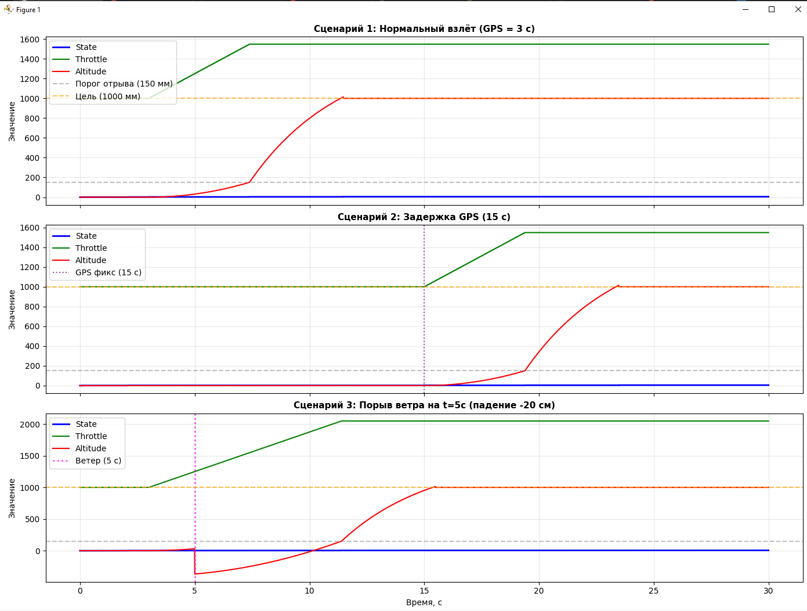
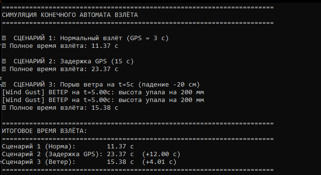
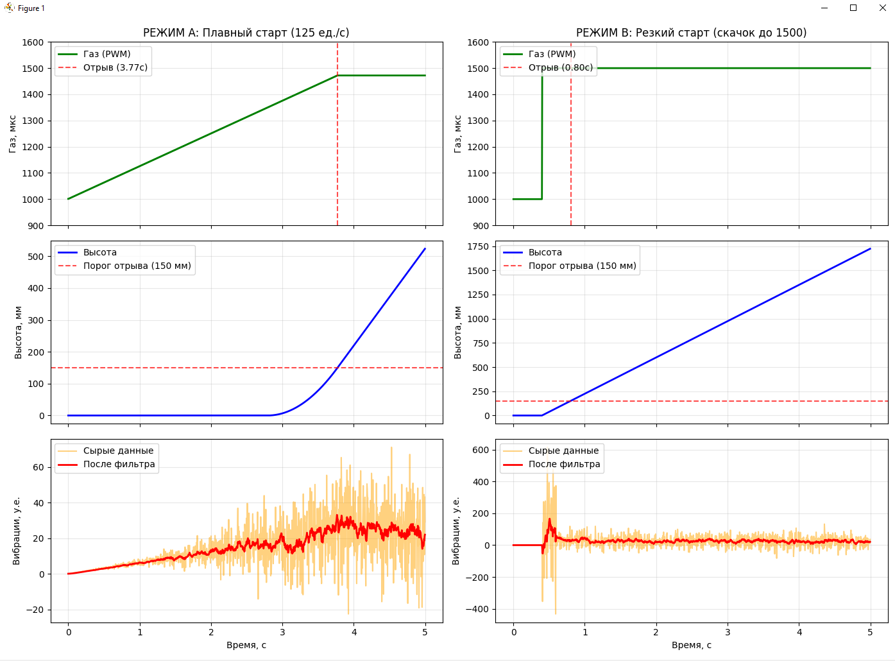
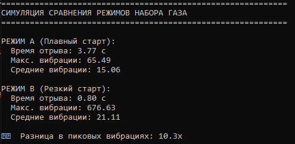
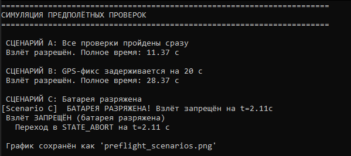
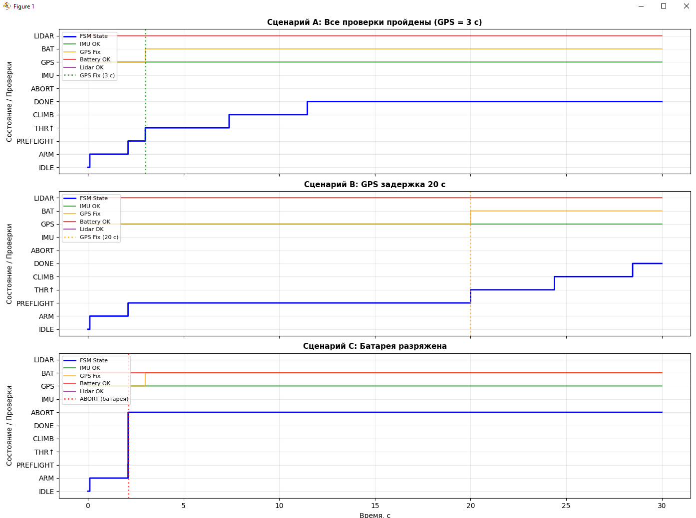

# «САНКТ-ПЕТЕРБУРГСКИЙ ГОСУДАРСТВЕННЫЙ УНИВЕРСИТЕТ ГРАЖДАНСКО АВИАЦИИ ИМЕНИ ГЛАВНОГО МАРШАЛА АВИАЦИИ А.А.НОВИКОВА»

Курсовой проект  
Тема: Алгоритм взлёта и посадки  
Исполнитель: Воденников Егор Игнатьевич  
Руководитель: Земсков Юрий Владимирович

## Содержание

- [1. Введение](#введение)
- [2. Теоретическая часть](#теоретическая-часть)
  - [2.1. Особенности взлёта и посадки беспилотных авиационных систем](#особенности-взлёта-и-посадки-беспилотных-авиационных-систем)
  - [2.2. Алгоритмы управления взлётом на основе конечных автоматов](#алгоритмы-управления-взлётом-на-основе-конечных-автоматов)
  - [2.3. Сенсорное обеспечение алгоритмов взлёта и посадки](#сенсорное-обеспечение-алгоритмов-взлёта-и-посадки)
  - [2.4. Алгоритмы управления газом и высотой](#алгоритмы-управления-газом-и-высотой)
  - [2.5. Обеспечение безопасности и анализ отказов](#обеспечение-безопасности-и-анализ-отказов)
- [3. Анализ исходного кода](#анализ-исходного-кода)
- [4. Структурные схемы и блок-схемы](#структурные-схемы-и-блок-схемы)
- [5. Расчётная часть](#расчётная-часть)
- [6. Заключение](#заключение)
- [7. Список использованных источников](#список-использованных-источников)

## Введение  

Современные беспилотные авиационные системы находят всё более широкое применение в различных сферах: аэрофотосъёмка, мониторинг объектов, доставка грузов и спасательных операций. Ключевым аспектом обеспечения безопасности и эффективности полётов БПЛА - это надёжность алгоритмов управления, особенно на наиболее критических фазах полёта - взлёте и посадке. 
Согласно статистике, при взлёте и посадке происходит большинство аварий беспилотных летательных аппаратов. К основным причинам можно отнести: опрокидывание при взлёте, жёсткая посадка, удар о землю при отказе двигателей или сенсоров, нестабильность системы управления. Эти факторы обуславливают повышенные требования к разработке и реализации алгоритмов взлёта и посадки, которые должны обеспечивать точную синхронизацию датчиков, двигателей и логики управления в реальном времени.
Микропроцессорные устройства, являющиеся основой систем управления БПЛА, реализуют сложные алгоритмы автоматического управления на основе данных от множества сенсоров: GPS-приёмников, инерциальных измерительных модулей (IMU), лидаров и других датчиков. Эффективность работы этих алгоритмов напрямую влияет на безопасность и успешность выполнения полётных миссий.  
**Цель курсовой работы:** исследование алгоритмов взлёта и посадки беспилотных авиационных систем, реализуемых на микропроцессорных устройствах.  
**Объект исследования:** микропроцессорные системы управления беспилотными летательными аппаратами.  
**Предмет исследования:** алгоритмы и программная реализация фаз взлёта и посадки БПЛА.  
Практическая значимость работы заключается в том, что полученные результаты могут быть использованы при изучении дисциплин, связанных с проектированием микропроцессорных устройств беспилотных авиационных систем, а также для совершенствовании систем автоматического управления мультироторных БПЛА


## 2.Теоретическая часть  

### 2.1.Особенности взлёта и посадки беспилотных авиационных систем {#21-особенности-взлёта-и-посадки-беспилотных-авиационных-систем}
**Взлёт и посадка**  
Взлёт и посадка — наиболее ответственные этапы полёта БПЛА. В отличие от крейсерского режима, они характеризуются малыми высотами, низкими скоростями и критической зависимостью от точности работы бортовых вычислительных и сенсорных систем.

**Статистика аварийности и основные причины происшествий**  
Согласно отраслевым данным, 60–70 % инцидентов с мультироторными БПЛА происходят при взлёте и посадке. Типовые причины: потеря устойчивости из-за резкого изменения тяги, опрокидывание при неравномерной раскрутке двигателей или порывах ветра, жёсткая посадка вследствие ошибок определения высоты, отказы сенсоров в условиях вибраций и помех. Критичен переход из покоя в режим висения, когда проявляются нестационарные аэродинамические эффекты (влияние экрана земли, перераспределение потоков), требующие мгновенной корректировки управляющих сигналов.


**Требования к надёжности алгоритмов управления**  
Алгоритмы должны обеспечивать детерминированное поведение в реальном времени, минимизировать человеческий фактор и компенсировать внешние возмущения. Ключевые параметры: точная синхронизация опроса датчиков и управляющих воздействий, плавность изменения сигналов тяги, встроенные механизмы аварийного прекращения полёта, сохранение управляемости при частичном отказе оборудования. Алгоритмы должны предусматривать чёткие критерии завершения фаз и безопасные переходы между ними.

**Специфика микропроцессорной реализации**  
Практическая реализация требует параллельной обработки данных от разнородных сенсоров (IMU, барометры, лидары, GNSS) с высокой частотой дискретизации. Микроконтроллер должен работать в режиме жёсткого реального времени, поддерживать механизмы контроля целостности (watchdog, проверка питания) и изоляцию критических задач. От качества программно-аппаратной реализации напрямую зависит стабильность и безопасность взлёта и посадки.


### 2.2.Алгоритмы управления взлётом на основе конечных автоматов  

**Теория конечных автоматов и их применение в авионике**  
Конечный автомат (Finite State Machine, FSM) — это математическая модель, описывающая поведение системы через конечное множество дискретных состояний, правила переходов между ними и ассоциированные действия. В микропроцессорных системах управления БПЛА конечные автоматы выступают основным архитектурным шаблоном для организации логических последовательностей, где критически важны предсказуемость, детерминизм и отсутствие гонок данных. В отличие от непрерывных контуров стабилизации, FSM позволяют чётко разделять фазы подготовки, диагностики, запуска и штатного полёта, изолируя каждую процедуру в отдельный узел. Современные автопилоты (PX4, ArduPilot, Betaflight) используют иерархические и параллельные конечные автоматы, что обеспечивает модульность кода, упрощает верификацию и снижает вероятность нештатных переходов. Для микроконтроллерных платформ FSM обладают минимальным накладным расходом ОЗУ и процессорного времени, что делает их идеальным инструментом для работы в условиях жёсткого реального времени.

**Построение диаграмм состояний для алгоритмов взлёта**  
Проектирование алгоритма взлёта начинается с формализации процесса в виде диаграммы состояний. Типовая структура включает узлы: `Ожидание команды`, `Инициализация силовой установки`, `Проверка сенсоров и фиксация домашней точки`, `Плавный набор газа`, `Набор целевой высоты` и `Переход в основной режим`. Каждый узел описывается внутренними действиями (опрос датчиков, расчёт уставки, обновление флагов) и исходящими переходами. При построении диаграммы необходимо соблюдать принципы полноты (все возможные сценарии покрыты) и непротиворечивости (переходы не пересекаются). Условия выхода из состояния формулируются как логические конъюнкции: готовность сенсоров ∧ отсутствие ошибок ∧ выполнение временной выдержки. Аварийные переходы (например, при критическом крене или потере питания) должны иметь наивысший приоритет и вести в состояние аварийного останова или безопасного снижения. Визуализация выполняется в нотации UML State Machine или в виде блок-схем, где явно указаны триггеры, guard-условия и эффекты.

**Процедура инициализации электронных регуляторов хода (ESC)**  
Инициализация (арминг) ESC представляет собой служебную последовательность обмена сигналами между полётным контроллером и регуляторами, подтверждающую готовность двигательной группы к работе. Основная задача процедуры — исключить случайный запуск двигателей при подаче питания, монтаже воздушных винтов или калибровке, а также синхронизировать начальные параметры управляющих сигналов. В рамках конечного автомата этому этапу выделяется отдельное состояние с фиксированной длительностью. В течение этого периода контроллер удерживает на выходах минимально допустимый уровень сигнала (обычно 1000 мкс), опрашивает статусные линии ESC и проверяет отсутствие аппаратных ошибок (перегрев, обрыв фазы, механическая блокировка). Только после успешного завершения последовательности и подтверждения синхронизации всех каналов система получает разрешение на переход к генерации управляющей тяги.

**Методы активации и жесты управления в RC-системах**  
Для перевода БПЛА в состояние готовности к взлёту в радиоуправляемых системах применяются комбинированные стиковые команды (жесты). Стандартная комбинация для арминга: стик газа в нижнем положении одновременно со стиком рыскания, отклонённым вправо до упора. Дизарминг выполняется зеркальной командой (газ вниз + рыскание влево). Выбор данных комбинаций обусловлен эргономикой и требованиями безопасности: такие положения стиков практически не возникают случайно в процессе пилотирования, что минимизирует риск непреднамеренной активации. Микропроцессорная реализация включает непрерывный мониторинг каналов радиолинии, цифровую фильтрацию дребезга, проверку пороговых уровней и валидацию текущего состояния автомата. Команда принимается только при совпадении всех условий, после чего инициируется соответствующий переход FSM. Альтернативными способами активации могут выступать программные переключатели на наземной станции управления или автономные триггеры от внешних модулей миссии.

**Временные параметры состояний и условия переходов**  
Надёжная работа конечного автомата взлёта требует строгой регламентации временных характеристик. Каждое состояние характеризуется минимальным и максимальным временем пребывания, что предотвращает зависание логики и обеспечивает своевременную реакцию на изменения среды. Например, состояние инициализации ESC требует фиксированной выдержки (порядка 2 секунд) для стабилизации внутренних процессов регуляторов, а состояние ожидания GPS-фикса ограничивается таймаутом (обычно 30–60 секунд), по истечении которого система либо переходит в резервный режим, либо генерирует предупреждение оператору. Условия переходов объединяют данные сенсоров, флаги готовности и временные счётчики. В микропроцессорной реализации таймеры и циклические счётчики организуются неблокирующим образом, чтобы не нарушать периодичность опроса датчиков и работы контуров стабилизации. Грамотное распределение временных окон позволяет синхронизировать медленные процессы (поиск спутников, прогрев инерциальных модулей) с быстрыми реакциями (коррекция тяги, аварийное отключение), обеспечивая плавный и безопасный переход к штатному полёту.


### 2.3.Сенсорное обеспечение алгоритмов взлёта и посадки  
**GPS-навигация: фиксация домашней точки и требования к точности**  
GNSS-модули обеспечивают позиционирование для автономных сценариев возврата. При взлёте алгоритм фиксирует координаты «домашней точки» для функции RTL.
Ключевое требование — устойчивый 3D-фикс (спутников ≥6, HDOP < 2.0). 3D-фикс это режим работы GNSS-приёмника, при котором для расчёта координат используются сигналы минимум четырёх спутников, что позволяет определить широту, долготу и высоту, а также скорректировать расхождение часов приёмника относительно спутниковых. Статус «3D Fix» подтверждает, что решение навигационной задачи получено с известной точностью, в отличие от режима 2D (только координаты на плоскости) или поиска спутников. Требование ≥6 видимых спутников обусловлено необходимостью избыточности измерений. Четыре спутника — это математический минимум для определения позиции. HDOP (Horizontal Dilution of Precision) — геометрический фактор снижения точности в горизонтальной плоскости. Он характеризует взаимное расположение видимых спутников на небосводе: чем равномернее они распределены, тем меньше значение HDOP и выше точность позиционирования. Интерпретация значений: HDOP < 1.0 — идеальная геометрия, точность до 1–2 м; 1.0 ≤ HDOP < 2.0 — хорошая геометрия, приемлемо для взлёта БПЛА; 2.0 ≤ HDOP < 5.0 — удовлетворительно, возможны ошибки 5–10 м; HDOP ≥ 5.0 — плохая геометрия (спутники сгруппированы), точность резко падает.

**Инерциальные измерительные модули (IMU): калибровка и обработка данных**  
IMU (акселерометр, гироскоп, магнитометр) предоставляет данные об ориентации и ускорениях, критичные для стабилизации при взлёте и посадке. Перед запуском обязательна калибровка: коррекция смещений акселерометра, компенсация дрейфа гироскопа, учёт магнитных аномалий. Данные обрабатываются в контуре стабилизации с частотой 1–8 кГц. Важна защита от вибраций силовой установки, способных искажать расчёты и дестабилизировать ПИД-регуляторы.

**Дальномеры (лидары/сонары): определение высоты и момента отрыва/касания**  
На малых высотах (сантиметры–метры) применяются лазерные лидары или ультразвуковые сонары. Лидары обеспечивают высокую точность (до мм) и быстрый отклик, сонары устойчивее к запылённости, но более инерционны. В алгоритме взлёта пороговое значение (100–150 мм) сигнализирует об отрыве, инициируя переход к удержанию высоты. При посадке датчик фиксирует касание для остановки двигателей. Эффективность зависит от отражающих свойств поверхности и угла установки датчика.


**Фильтрация показаний датчиков и предотвращение ложных срабатываний**  
Сырые данные сенсоров содержат шум и выбросы. Для повышения надёжности применяются: комплементарные фильтры и фильтры Калмана для IMU, медианные/скользящие средние для дальномеров. Вводится временная валидация — событие считается достоверным при сохранении условия в течение нескольких циклов опроса. Гистерезис пороговых значений предотвращает «дребезг» состояний при колебаниях высоты у границы срабатывания, исключая ложные переключения режимов.


### 2.4.Алгоритмы управления газом и высотой  
**Методы плавного набора газа и их влияние на стабильность полёта**  
Резкое изменение тяги при взлёте вызывает вибрации рамы и возмущения, которые IMU может интерпретировать как движение, дестабилизируя контуры управления. Для предотвращения этого применяется функция плавного нарастания газа (throttle ramp) с ограничением скорости изменения сигнала (100–150 ед/с). Увеличение осуществляется по линейному или экспоненциальному закону в рамках основного цикла управления. Плавный разгон позволяет конструкции и регуляторам адаптироваться к нагрузке, обеспечивая стабильный отрыв без рывков.


**Расчёт параметров набора высоты и скорости снижения**  
После отрыва вертикальное движение контролируется ПИД-регулятором высоты на основе данных барометра или лидара. Скорость набора и снижения ограничивается программно для безопасности: типовая вертикальная скорость посадки — 0,5–1,2 м/с. В микропроцессорной системе этот параметр рассчитывается как произведение базовой уставки на период цикла управления. Регулятор компенсирует возмущения (ветер, плотность воздуха), динамически корректируя газ, при этом итоговая вертикальная скорость не должна превышать порога жёсткой посадки.


**Алгоритмы автоматической посадки и возврата на точку запуска (RTL)**  
Функция RTL активируется при потере связи или по команде. Алгоритм включает две фазы: горизонтальное перемещение к домашней точке (по GPS) и вертикальное снижение. После достижения цели система переключается в режим посадки, где вертикальный контур опирается на барометр и дальномер. Контроллер последовательно снижает уставку высоты, контролируя вертикальную скорость. При обнаружении касания инициируется дизарминг. Логика интегрирована в общий конечный автомат полёта.


**Проблема жёсткой посадки и методы её предотвращения**  
Жёсткая посадка возникает при превышении допустимой вертикальной скорости в момент касания, что ведёт к повреждениям. Причины: запаздывание фильтров, агрессивные параметры снижения, ветер, ошибка детектирования касания. Для предотвращения применяются ограничители скорости снижения и адаптивное замедление у земли. Алгоритм детектирования касания анализирует расстояние, скорость его изменения и скачок ускорения по акселерометру. При подтверждении касания контроллер обнуляет газ и блокирует повторный запуск, исключая подпрыгивание аппарата.


### 2.5.Обеспечение безопасности и анализ отказов  
**Классификация критических точек отказа при взлёте и посадке**  
На этапах взлёта и посадки запас высоты и времени на реакцию минимален, поэтому любые отклонения классифицируются как критические. Отказы делятся на аппаратные (двигатели, ESC, питание), сенсорные (IMU, GNSS, дальномеры) и алгоритмические (сбои FSM, таймауты). Критичность оценивается по вероятности и тяжести последствий. Перед запуском система выполняет проверку готовности всех узлов, блокируя активные состояния при обнаружении несоответствий.


**Отказы двигательной системы и методы защиты**  
Отказ двигателя или ESC при наборе тяги создаёт асимметрию, ведущую к потере управления. Для защиты применяются: мониторинг тока и температуры регуляторов, контроль обратной связи по оборотам, мгновенное аварийное отключение (disarm) при обнаружении неисправностей. В системах с избыточностью возможно перераспределение управляющих сигналов для управляемого снижения, однако в стандартной конфигурации это требует сложных алгоритмов компенсации момента.


**Сбои сенсорных систем: стратегии поведения**  
Потеря данных от ключевых датчиков требует адаптивного поведения. При отсутствии GPS-фикса блокируются автоматические сценарии возврата, система переходит на удержание по инерциальным данным. Сбои IMU детектируются через проверку согласованности акселерометра и гироскопа; при расхождении активируется безопасная посадка. Отказ лидара компенсируется переключением на барометр. Стратегия «грациозной деградации» сохраняет базовую управляемость при частичной потере сенсоров.


**Алгоритмы обнаружения нештатных ситуаций и аварийной остановки**  
Безопасность обеспечивается механизмами детектирования аномалий в реальном времени. Алгоритм обнаружения опрокидывания отслеживает углы крена/тангажа: при превышении порога (30–45°) инициируется немедленный disarm. Контроль напряжения батареи активирует принудительную посадку при падении ниже критического уровня. Для защиты от зависания кода используются watchdog-таймеры, переводящие систему в безопасное состояние при нарушении периодичности цикла.

**Влияние внешних факторов и типичные ошибки реализации**  
Внешние условия (ветер, эффект земли, свойства поверхности) влияют на надёжность алгоритмов. Типичные ошибки разработки: взлёт без фиксации домашней точки, агрессивный набор газа, вызывающий вибрации, ложные срабатывания датчиков без фильтрации. Для минимизации рисков применяются адаптивные коэффициенты, временная валидация событий, чёткая индикация статусов и строгое соблюдение временных диаграмм конечного автомата.

## 3.Анализ исходного кода  

Исходный код функции `Takeoff()` демонстрирует классическую реализацию конечного автомата на основе оператора `switch-case`. Такая структура обеспечивает наглядность переходов между состояниями, простоту отладки и модификации. Автомат включает шесть состояний (0–5), каждое из которых инкапсулирует определённую фазу взлёта. Управление состоянием осуществляется через глобальную переменную `takeoff_state`, которая сохраняет своё значение между вызовами функции. Для временных выдержек используется счётчик `arm_timer` в каждом цикле.

**Анализ состояния ожидания команды (Case 0)**
```python
case 0: // Ожидание команды взлёта
    if ( channel_3 < 1050 && channel_4 > 1950) {
        arm_timer = 0;
        takeoff_state = 1;
    }
    break;
```
В состоянии 0 реализуется детектирование жеста активации взлёта. Условие `channel_3 < 1050 && channel_4 > 1950` проверяет одновременное нахождение стика газа в нижнем положении (менее 1050 мкс) и стика рыскания в крайнем правом положении (более 1950 мкс). Такая комбинация выбрана для исключения случайной активации.
При выполнении условия счётчик `arm_timer` обнуляется, и происходит переход в состояние 1.

**Реализация процедуры арминга ESC (Case 1)**
```python
case 1: // Arm sequence : инициализация ESC
   arm_timer ++;
    motor_1 = motor_2 = motor_3 = motor_4 = 1000;
    if ( arm_timer >= 500) { // 500 * 4 мс = 2 с
    takeoff_state = 2;
    }
    break;
```
Состояние 1 реализует критически важную процедуру инициализации электронных регуляторов. В строке 27 всем четырём двигателям устанавливается минимальный сигнал 1000 мкс, что соответствует стандарту протокола PWM для ESC. Это значение не нулевое, так как регуляторы требуют наличия минимального сигнала для подтверждения активности и предотвращения случайного запуска.
В строке 24 счётчик `arm_timer` инкрементируется при каждом вызове функции. Условие `if (arm_timer >= 500)` (строка 28) проверяет достижение 500 циклов. При стандартном периоде цикла 4 мс это составляет ровно 2 секунды (500 × 4 мс = 2000 мс), что соответствует требованиям большинства ESC к процедуре арминга.

**Проверка сенсоров и фиксация домашней точки (Case 2)**
```python
case 2: // Проверка датчиков и фиксация домашней точки
    // Ждём GPS -фикс (минимум 6 спутников, HDOP < 2.0)
    if ( gps_valid && gps_satellites >= 6) {
        home_latitude = gps_latitude ;
        home_longitude = gps_longitude ;
        home_altitude = actual_altitude ;
        takeoff_state = 3;
    }
    // Таймаут: если GPS не захватил за 60 с,
    // взлетаем без GPS ( RTH будет недоступен)
    if ( arm_timer > 15000) { // 60 с
        takeoff_state = 3;
    }
    break ;
```
В состоянии 2 реализуется логика работы с GPS-модулем. Условие `gps_valid && gps_satellites >= 6` (строка 35) проверяет два критических параметра: наличие валидного 3D-фикса и достаточное количество видимых спутников. Порог в 6 спутников обеспечивает приемлемую точность позиционирования.
При выполнении условия фиксируются координаты домашней точки (`home_latitude`, `home_longitude`, `home_altitude`), которые будут использованы для функции возврата RTL. После этого происходит переход в состояние 3.
Строки 43–45 реализуют механизм таймаута: если GPS-фикс не получен в течение 60 секунд (15000 циклов × 4 мс), система принудительно переходит к следующей фазе. Это предотвращает бесконечное зависание в состоянии ожидания.

**Алгоритм плавного набора газа (Case 3)**
```python
case 3: // Плавный набор газа до отрыва
    // Увеличиваем газ на 1 единицу каждые 2 цикла
    if ( arm_timer % 2 == 0)
        takeoff_throttle ++;
        motor_1 = motor_2 = motor_3 = motor_4 = takeoff_throttle ;
        // Отрыв определяется по лидару: расстояние уменьшается
        // (дрон поднимается, расстояние до земли растёт)
    if ( lidar_distance > 150) { // 15 см от земли
        takeoff_state = 4;
        lidar_setpoint = TAKEOFF_ALTITUDE ; // целевая высота в мм
        }
    break ;
```
Состояние 3 реализует ключевой алгоритм плавного увеличения тяги. Условие `if (arm_timer % 2 == 0)` (строка 50) обеспечивает приращение переменной `takeoff_throttle` каждые 2 цикла, то есть каждые 8 мс. Это соответствует скорости нарастания газа 125 единиц/с (1 единица / 8 мс).
В строке 53 рассчитанное значение газа применяется ко всем четырём двигателям, обеспечивая симметричную тягу.
Определение момента отрыва от земли (строки 57–59) осуществляется по лидару: когда расстояние до поверхности превышает 150 мм (15 см), система фиксирует отрыв и переходит в состояние 4. Порог 150 мм выбран не случайно: он превышает амплитуду вибраций рамы на земле и учитывает возможный наклон поверхности.
После отрыва в строке 60 устанавливается целевая высота `lidar_setpoint` из константы `TAKEOFF_ALTITUDE`, что инициирует переход к режиму удержания высоты.

**Набор высоты и стабилизация (Case 4)**
```python
case 4: // Набор целевой высоты
    // Лидарный ПИД управляет высотой
    // Ждём стабилизации на целевой высоте
    if ( fabs ( lidar_distance - lidar_setpoint ) < 50) { // ±5 см
        hover_timer ++;
        if ( hover_timer >= 125) { // 0.5 с стабильного висения
            takeoff_state = 5;
        }
    } else {
        hover_timer = 0;
    }
    break ;
```

В состоянии 4 реализуется контур управления высотой на основе данных лидара. Условие `if (fabs(lidar_distance - lidar_setpoint) < 50)` (строка 66) проверяет, находится ли текущая высота в пределах ±5 см от целевой. Функция `fabs` вычисляет модуль разности, обеспечивая проверку по абсолютному значению.
При выполнении условия инкрементируется счётчик `hover_timer` (строка 67). Когда время стабильного висения достигает 125 циклов (строка 69), что соответствует 0,5 секунды (125 × 4 мс = 500 мс), система переходит в состояние 5. Такая временная выдержка необходима для подтверждения, что дрон действительно стабилизировался на целевой высоте, а не просто случайно оказался в допустимом диапазоне.
В противном случае (строка 71–72) счётчик сбрасывается, что требует повторного прохождения 0,5-секундного интервала стабильности.
В данном состоянии предполагается работа внешнего ПИД-регулятора высоты, который не показан в листинге, но должен функционировать параллельно с конечным автоматом, корректируя значение `takeoff_throttle` на основе рассогласования высоты.

**Завершение взлёта и переход в основной режим (Case 5)**
```python
case 5: // Взлёт завершён, переход в режим полёта
    flight_mode = 2; // активируем удержание высоты
    takeoff_state = 0;
    break ;
```
Состояние 5 является финальным: в строке 77 устанавливается `flight_mode = 2`, что активирует режим удержания высоты в основном контуре управления полётом. В строке 78 переменная `takeoff_state` сбрасывается в 0, что завершает работу автомата взлёта и возвращает систему в состояние ожидания для следующего цикла.
Такая реализация обеспечивает цикличность: после завершения взлёта система готова к выполнению следующей миссии или повторному взлёту после посадки.  

## Структурные схемы и блок-схемы  
.jpg)  
Рисунок 1 - диаграмма переходов для задания 13.1 а)  
*Текстовое описание:* Диаграмма показывает 6 состояний конечного автомата взлёта:
- **State 0:** Ожидание команды (жест: газ↓ + рыскание→)
- **State 1:** Arm sequence (2 с, газ = 1000 мкс)
- **State 2:** Проверка GPS (фикс домашней точки)
- **State 3:** Плавный набор газа (125 ед/с, отрыв при lidar > 150 мм)
- **State 4:** Стабилизация высоты (±50 мм, 0.5 с)
- **State 5:** Завершение, переход в режим полёта


.png)  
Рисунок 2 - график скорости наростания газа для задания 13.3 с)  


.jpg)  
Рисунок 3 - Блок-схема алгоритма посадки для задания 13.4 а)
*Текстовое описание:* Алгоритм посадки состоит из двух фаз:
1. **Снижение (Case 4):** Пока `actual_altitude > 0.3 м`, газ уменьшается со скоростью `RTH_DESCENT_RATE`.
2. **Касание (Case 5):** При `lidar_distance < 50 мм` устанавливается минимальный газ и выполняется дизарминг.


## Расчётная часть  
### Задание 13.1
**a) Постройте диаграмму состояний конечного автомата взлёта. Для каждого состояния укажите действие и условие перехода.**  

.jpg)


**b) Рассчитайте минимальное и максимальное время каждого состояния:**
Дано:

| Состояние | Мин. время | Макс. время | Ограничивающий фактор |
|-----------|------------|-------------|----------------------|
| 1 (Arm) | 2 с | 2 с | Фиксированный таймер |
| 2 (GPS) | 0 | ∞ | Команда пилота |
| 3 (набор газа) | ? | ? | ? |
| 4 (набор высоты) | ? | ? | ? |

**Расчёт временных параметров состояний**


**Case 3 (набор газа)**

Расчёт минимального и максимального времени. Из кода известно:

- Начальное значение газа: 1000 мкс (после Arm sequence)
- Типичное значение отрыва: 1350 мкс
- Скорость нарастания: 1 единица каждые 8 мс (каждые 2 цикла по 4 мс)

Расчёт:

- Необходимое приращение: 1350 - 1000 = 350 единиц
- Время: 350 × 8 мс = 2800 мс = 2,8 с

Поскольку алгоритм детерминированный (фиксированная скорость нарастания), минимальное и максимальное время совпадают.

Ограничивающий фактор: скорость нарастания газа

**Case 4 (набор высоты)**  
Расчёт минимального времени:
Из кода (строки 66-70):

- Требуемая точность стабилизации: ±50 мм от целевой высоты
- Счётчик `hover_timer` должен достичь 125 циклов
- Период цикла: 4 мс

Минимальное время: 125 × 4 мс = 500 мс = 0,5 с  
В текущей реализации нет явного таймаута для состояния 4. Теоретически, если дрон не сможет стабилизироваться (сильный ветер, неисправность ПИД-регулятора, некорректные показания лидара), система может остаться в этом состоянии неограниченно долго.  
**Итог**

| Состояние | Мин. время | Макс. время | Ограничивающий фактор |
|-----------|------------|-------------|----------------------|
| 0 (ожидание) | 0 | ∞ | Команда пилота |
| 1 (Arm) | 2 с | 2 с | Фиксированный таймер |
| 2 (GPS) | 0 с | 60 с | GPS-фикс |
| 3 (набор газа) | 2,8 с | 2,8 с | Скорость нарастания газа |
| 4 (набор высоты) | 0,5 с | ∞ | Стабилизация по высоте |


**a)Рассчитайте время Arm sequence:**  

Формула: t~arm~ = N~cycles~ * T~loop~ = ?с  
Дано:  

- N~cycles~ = = 500 циклов (необходимое количество циклов для Arm sequence)
- T~loop~ = 4 мс (период основного цикла программы)

Расчёт:  
t~arm~ = 500 ⋅ 4 мс = 2000 мс = 2 с  

**c) Объясните, почему во время Arm sequence все моторы получают сигнал 1000 мкс (минимум), а не 0. Что означает сигнал 1000 мкс для ESC?**  
**Почему используется 1000 мкс, а не 0 мкс:**  
В классическом протоколе управления ESC (PWM) рабочий диапазон длительности импульса составляет 1000–2000 мкс. Сигнал длительностью 0 мкс аппаратно и программно интерпретируется как полное отсутствие сигнала  

**Что означает сигнал 1000 мкс для ESC:**  
Значение 1000 мкс соответствует минимальному активному уровню газа. удержание сигнала на уровне 1000 мкс во время Arm sequence обеспечивает корректную инициализацию силовой установки, исключает ложное срабатывание защиты от потери сигнала и предотвращает случайный запуск двигателей до получения команды на набор газа.  

**d) Найдите в коде, как предотвращается случайный взлёт (защита от непреднамеренного arm). Достаточна ли эта защита?**  

**Специальная комбинация стиков**  
```python
if (channel_3 < 1050 && channel_4 > 1950) {
    arm_timer = 0;
    takeoff_state = 1;
}
```  
Защита реализуется через:  

- Одновременное выполнение двух условий: газ в минимуме (CH3 < 1050 мкс) И рыскание вправо до упора (CH4 > 1950 мкс)
- Неестественная комбинация: такое положение стиков практически невозможно в нормальном режиме пилотирования, что исключает случайную активацию

**Временная задержка подтверждения**  

```python
arm_timer++;
// ...
if (arm_timer >= 500) {  // 500 * 4 мс = 2 с
    takeoff_state = 2;
}
```   
Защита реализуется через:  

- Обязательное удержание комбинации в течение 2 секунд (500 циклов × 4 мс)
- Счётчик сбрасывается при нарушении условия, требуя повторного прохождения всей последовательности
- Исключение кратковременных случайных срабатываний от резких движений стиками  


**Недостатки и рекомендации по усилению защиты:**  

- Нет проверки напряжения батареи (Рекомендация: Добавить `if (battery_voltage > MIN_VOLTAGE)` для предотвращения взлёта с разряженным аккумулятором)
- Отсутствует проверка горизонта (Рекомендация: Проверить углы наклона: `if (abs(roll) < 15° && abs(pitch) < 15°)` — взлёт только в горизонтальном положении)


### Задание 13.2  

**a) Рассчитайте скорость нарастания газа в состоянии 3: 1 единица каждые 2 цикла = 1 единица каждые 8 мс.**  
Скорость нарастания газа:

- Период цикла: $T_{loop} = 4$ мс
- Приращение: 1 единица каждые 2 цикла
- Время: $2 \times 4 \text{ мс} = 8 \text{ мс} = 0.008 \text{ с}$

$$\frac{d(throttle)}{dt} = \frac{1 \text{ ед.}}{0.008 \text{ с}} = 125 \text{ ед./с}$$  

**b) Рассчитайте время набора газа от 1000 до типичного значения отрыва 1350 мкс**  
Время набора газа до типисного отрыва: $\frac{1350 - 1000}{125} = 2.8 с$  

**c) Постройте график нарастания газа во времени. Объясните,почему плавный набор лучше резкого. Что произойдёт при резком подаче газа?**  

.png)  

**Почему плавный набор лучше резкого?**  

- *Снижение вибраций.* Резкая подача газа вызывает ударную нагрузку на раму и высокочастотные вибрации. Плавный разгон позволяет механической системе адаптироваться к нагрузке без возникновения резонансных колебаний.
- *Корректная работа IMU.* Вибрации от моторов интерпретируются инерциальными датчиками как ложное движение, что искажает данные акселерометра и гироскопа. При плавном наборе уровень вибраций остаётся в пределах, компенсируемых фильтрами.
- *Стабильность ПИД-регуляторов.* Резкое изменение тяги может вызвать насыщение регулятора и потерю устойчивости контура стабилизации. Плавное нарастание обеспечивает корректный переходный процесс и позволяет регулятору подобрать коэффициенты.
- *Аэродинамика.* Плавный старт минимизирует нестационарные эффекты: влияние экрана земли, взаимодействие воздушных потоков винтов и турбулентность, обеспечивая выход на установившийся режим полёта.  


**Что произойдёт при резкой подаче газа?**  

- *Потеря устойчивости.* Дрон резко подпрыгивает вверх, из-за неравномерной раскрутки двигателей возникает крен, возможна потеря управления и опрокидывание.
- *Срыв автопилота.* Вибрации вызывают насыщение акселерометра, ПИД-регулятор получает искажённые данные и теряет обратную связь с системой.
- *Механические повреждения.* Ударная нагрузка ослабляет крепления двигателей, винты испытывают повышенные напряжения, при подпрыгивании возможен удар о землю с повреждением рамы.
- *Сбои датчиков.* Лидар показывает некорректное расстояние, барометр фиксирует ложный скачок высоты, GPS может временно потерять фикс из-за электромагнитных помех.


**c)Объясните, как лидар определяет момент отрыва. Почему порог 150 мм (15 см), а не 0 мм?**  

**Как лидар определяет момент отрыва:** Лидар непрерывно измеряет расстояние до поверхности. При подъёме дрона показания увеличиваются. Когда `lidar_distance` превышает порог (150 мм), алгоритм фиксирует отрыв и переключает автомат в фазу удержания высоты.  

**Почему порог 150 мм, а не 0 мм:**    

- *Вибрации.* Колебания рамы от работы моторов вызывают флуктуации показаний. Порог 150 мм исключает ложные срабатывания от механических вибраций.
- *Шум датчика.* Измерительный шум и конечная точность лидара требуют запаса для надёжного детектирования реального подъёма.
- *Высота шасси.* Типовая высота посадочных опор 100–200 мм. Порог 150 мм гарантирует полный отрыв от поверхности.  


### Задание 13.4  
**a)Найдите в коде алгоритм посадки (он может быть частью RTH или отдельной функцией). Постройте его блок-схему.**  

Алгоритм посадки в предоставленном листинге реализован как завершающая фаза режима возврата на точку запуска (RTH). Он находится в функции `return_to_home()` и занимает состояния 4 и 5 конечного автомата `rth_state`.  

**Фаза снижения:**  
```python
case 4: // Снижение
    // Уменьшаем газ для снижения
    if ( actual_altitude > 0.3) {
        throttle_adjust -= RTH_DESCENT_RATE ;
        // RTH_DESCENT_RATE = 2 единицы/цикл
    } else {
        rth_state = 5; // переходим к посадке
    }
    break ;
```  
**Контролируемое снижение (Case 4)**  

- Система проверяет текущую высоту (`actual_altitude`)
- Пока высота больше 0.3 м (30 см), газ плавно уменьшается с заданной скоростью (`RTH_DESCENT_RATE`)
- Как только высота становится меньше или равна 0.3 м, автомат переходит в следующее состояние


**Фаза финальной посадки и отключения моторов:**  
```python
case 5: // Посадка
    // Минимальный газ, ждём касания земли
    throttle_adjust = THROTTLE_LAND ;
    if ( lidar_distance < 50) { // менее 5 см до земли
        // Отключаем моторы
        flight_mode = 1;
        rth_state = 0;
    }
    break ;
```  
**Касание и отключение (Case 5)**  

- Газ устанавливается на минимальное посадочное значение (`THROTTLE_LAND`)
- Система ждёт подтверждения касания земли по лидару (`lidar_distance < 50` мм)
- После касания режим полёта меняется (`flight_mode = 1`), что означает отключение моторов (Disarm), и состояние RTH сбрасывается  


**Блок-схема алгоритма посадки:**  

.jpg)  

**b) Объясните, как определяется касание земли. Какой датчик используется? Каков порог?**  

*Как определяется касание земли:* касание земли определяется по достижению минимального расстояния от дрона до поверхности. В состоянии 5 (посадка) алгоритм непрерывно контролирует показания дальномера. Когда дрон снижается до критически малой высоты, система фиксирует событие касания и инициирует отключение двигателей.  
*Какой датчик используется:* для детектирования касания используется лидар (лазерный дальномер). В коде это переменная lidar_distance, которая содержит текущее измеренное расстояние до земли в миллиметрах.  
Лидар выбран потому что:  

- Обеспечивает высокую точность измерений (до миллиметров)
- Имеет быстрый отклик
- Работает на малых высотах (0–500 мм), где барометр и GPS неэффективны

*Порог срабатывания:* пороговое значение составляет 50 мм (5 см).  
В коде:  
```python
if (lidar_distance < 50) {  // менее 5 см до земли
    // Отключаем моторы
}
```  
Почему выбран порог 50 мм:  

- Запас на вибрации — при работе моторов рама вибрирует, и расстояние колеблется. Порог 50 мм предотвращает ложные срабатывания.
- Высота шасси — посадочные опоры обычно выступают на 50–100 мм, поэтому к моменту, когда корпус будет в 5 см от земли, опоры уже коснутся поверхности.


**c) Объясните проблему «жёсткой посадки»: что произойдёт, если дрон снижается слишком быстро и лидар не успевает обнаружить землю? Предложите защитный алгоритм.**  

Дано:  

- RTH_DESCENT_RATE = 2 единицы/цикл (из кода программы: `// RTH_DESCENT_RATE = 2 единицы/цикл`)
- Период цикла T~loop~ = 4 мс = 0,004 с  
  
Расчёт:  
Скорость снижения газа: $\frac{RTH DESCENT RATE}{T~loop~}$ = \frac{2 ед/цикл}{0,004 с/цикл} = 500 ед/с  
**Важное уточнение:** Полученное значение **500 мкс/с** — это скорость изменения *управляющего сигнала* (PWM), а не вертикальная скорость снижения дрона в м/с.

Для перевода в физическую скорость (м/с) требуется знать:
- Передаточную характеристику «газ → тяга» для конкретной силовой установки
- Аэродинамические параметры дрона (масса, коэффициент сопротивления)
- Эффективность винтов на малых высотах

**Ориентировочная оценка:** Для типового квадрокоптера массой 1–1.5 кг изменение газа на 100 мкс соответствует вертикальной скорости ~0.1–0.2 м/с. Следовательно, 500 мкс/с ≈ **0.5–1.0 м/с**, что находится в безопасном диапазоне посадки.
Ответ: Скорость уменьшения управляющего сигнала составляет 500 единиц/с (или 500 мкс/с).  

**c) Объясните проблему «жёсткой посадки»: что произойдёт, если дрон снижается слишком быстро и лидар не успевает обнаружить землю? Предложите защитный алгоритм.**  

Если дрон снижается слишком быстро и лидар не успевает обнаружить землю, происходит жёсткая посадка (hard landing) со следующими последствиями:  

1. Механические повреждения:
    - Удар о землю на высокой скорости вызывает разрушение рамы, посадочных опор, крепление двигателей
    - Винты могут сломаться или погнуться от удара
    - Полезная нагрузка (камера, сенсоры) получает повреждения
2. Отскок и опрокидывание
    - При ударе дрон может подпрыгнуть на 10–50 см
    - Из-за инерции и неровностей поверхности аппарат опрокидывается на бок
    - Вращающиеся винты ударяются о землю, вызывая дальнейшее разрушение
3. Задержка реакции лидара
    - Средняя частота обновления лидара: 50–100 Гц (период 10–20 мс)
    - При скорости снижения 2 м/с за 20 мс дрон пролетает 4 см
    - Если дрон снижается со скоростью 3–5 м/с, за время обновления датчика он может уже удариться о землю, прежде чем лидар зафиксирует критическую высоту  

**Защитный алгоритм:**  

*Ограничение максимальной скорости снижения:*  
```python
// Максимальная безопасная скорость снижения
#define MAX_DESCENT_RATE 1.2  // м/с

// Проверка в каждом цикле
if (vertical_velocity > MAX_DESCENT_RATE) {
    // Принудительное увеличение газа
    throttle_adjust += EMERGENCY_CORRECTION;
}
```  

### Задание 13.5  

**a) Составьте таблицу критических точек отказа при взлёте**  

| Отказ                          | Состояние | Последствие и защита                                                                                                                                                  |
|--------------------------------|-----------|-----------------------------------------------------------------------------------------------------------------------------------------------------------------------|
| Отказ одного мотора при взлёте |     3     | Опрокидывание; защита отсутствует                                                                                                                                     |
| Лидар не видит землю           |     3     | Невозможно определить момент отрыва; дрон продолжает набирать скорость до максимума. Защита: тайм-аут состояния 3 (30 с) с аварийным сбросом газа; резервный барометр |
| IMU не откалиброван            |     2     | Некорректные данные об ориентации, потеря устойчивости при отрыве от земли.  Защита: проверка флага калибровки перед взлетом; блокировка перехода в состояние 3       |
| Батарея разряжена              |   любое   | Внезапное отключение питания, падение дрона.  Защита: мониторинг напряжения; блокировка взлета; принудительная посадка при разрядке в полете                          |
| Ветер при взлёте               |    3-4    | Дрейф, крен, столкновение с препятствиями.  Защита: проверка горизонтальной скорости; удержание позиции ПИД-регулятором; отмена взлёта при сильном ветре              |  

**Обоснование:**  

1. Лидар не видит землю (Case 3):  
    - Проблема: Алгоритм ждёт `lidar_distance > 150` для перехода в State 4. Если лидар показывает 0 (ошибка) или максимум (нет отражения), дрон зависает в State 3.  
    - Последствие: Газ продолжает расти до максимального значения, дрон может неконтролируемо подняться или перевернуться.  
    - Защита: 
```python
if (state3_timer > 30000) { // 30 секунд
    emergency_disarm();
}
```
2. IMU не откалиброван (Case 2):  
    - Проблема: Некорректные нули акселерометра/гироскопа приводят к ошибочному определению горизонта.
    - Последствие: При отрыве дрон наклоняется и летит не вверх, а в сторону.
    - Защита:  
```python
if (!imu_calibrated) {
    // Блокировка взлёта, уведомление пилота
    return;
}
```
3. Батарея разряжена (любое состояние):
    - Проблема: Напряжение ниже критического (например, < 3.3V на ячейку LiPo).
    - Последствие: Внезапное отключение ESC, падение дрона с высоты.
    - Защита:
```python
if (battery_voltage < 10.5) { // для 3S
    if (takeoff_state == 0) {
        // Блокировка арминга
    } else {
        // Принудительная посадка
        flight_mode = LAND;
    }
}
```
4. Ветер при взлёте (States 3-4):  
    - Проблема: Горизонтальный дрейф во время набора высоты.
    - Последствие: Столкновение с землёй или препятствиями из-за смещения.
    - Защита:  
```python
if (abs(velocity_x) > 2.0 || abs(velocity_y) > 2.0) {
    // Ветер слишком сильный — отмена взлёта
    emergency_land();
}
```  

**b) Найдите в коде проверку калибровки IMU перед взлётом. Еcли её нет - предложите, где и как её добавить.**  

Проверка калибровки IMU в коде отсутствует. В состоянии 2 (State 2 — проверка датчиков) выполняется только проверка GPS:  

```python
case 2: // Проверка датчиков и фиксация домашней точки
    if (gps_valid && gps_satellites >= 6) {
        // Фиксация home point...
        takeoff_state = 3;
    }
```  

**Где и как добавить проверку**  
Можно добавить проверку в State 2 (проверка датчиков), так как это логически правильное место для валидации всех сенсоров перед взлётом.  
Код:  

```python
case 2: // Проверка датчиков и фиксация домашней точки
    // === НОВАЯ ПРОВЕРКА: Калибровка IMU ===
    if (!imu_calibrated) {
        // IMU не откалиброван — блокируем взлёт
        // Можно добавить индикацию ошибки для пилота
        error_code = ERROR_IMU_NOT_CALIBRATED;
        // Возврат в состояние 0 или специальное состояние ошибки
        takeoff_state = 0;
        // Дизарминг для безопасности
        disarm_motors();
    }
    // === Далее идёт код, который был изначальнов case 3 ===
    // Ждём GPS-фикс (минимум 6 спутников, HDOP < 2.0)
    if (gps_valid && gps_satellites >= 6) {
        home_latitude = gps_latitude;
        home_longitude = gps_longitude;
        home_altitude = actual_altitude;
        takeoff_state = 3;
    }
    
    // Таймаут: если GPS не захватил за 60 с...
    if (arm_timer > 15000) {
        takeoff_state = 3;
    }
    break;
```  

**c) Предложите алгоритм обнаружения опрокидывания при взлёте: при каком угле крена или тангажа нужно немедленно остановить моторы?**  

**Критические углы для аварийной остановки**  

На основе анализа динамики мультироторных БПЛА и отраслевых стандартов (ArduPilot, PX4), были выбраны следующие пороговые значения:  

| Параметр       | Критический угол | Обоснование                                                                                                                                            |
|----------------|------------------|--------------------------------------------------------------------------------------------------------------------------------------------------------|
| Крен (Roll)    |       ±45°       | При угле >45° горизонтальная составляющая тяги превышает вертикальную, дрон теряет высоту и начинает смещаться в сторону. Винты могут коснуться земли. |
| Тангаж (Pitch) |       ±45°       | Аналогично крену — потеря вертикальной устойчивости и риск удара винтами о землю.                                                                      |
| Аварийный угол |       ±60°       | Абсолютный максимум — при таком угле винты гарантированно ударятся о землю при работе моторов.                                                         |  

Рекомендуемый порог: ±45° для немедленной остановки моторов.  

**Алгоритм обнаружения опрокидывания:**  

```python
// Пороговые значения
#define MAX_SAFE_ROLL_ANGLE     45.0    // градусов
#define MAX_SAFE_PITCH_ANGLE    45.0    // градусов
#define EMERGENCY_DISARM_DELAY  0       // мгновенная остановка

// Алгоритм проверки (вызывается в каждом цикле)
bool check_tipping_condition() {
    // Получаем текущие углы от IMU (в градусах)
    float current_roll = imu_get_roll_angle();
    float current_pitch = imu_get_pitch_angle();
    
    // Вычисляем абсолютные значения
    float abs_roll = fabs(current_roll);
    float abs_pitch = fabs(current_pitch);
    
    // Проверка крена
    if (abs_roll > MAX_SAFE_ROLL_ANGLE) {
        return true;  // Обнаружено опрокидывание по крену
    }
    
    // Проверка тангажа
    if (abs_pitch > MAX_SAFE_PITCH_ANGLE) {
        return true;  // Обнаружено опрокидывание по тангажу
    }
    
    return false;  // Всё в пределах нормы
}

// Функция аварийной остановки
void emergency_disarm_on_tipping() {
    if (check_tipping_condition()) {
        // Немедленная остановка всех моторов
        motor_1 = motor_2 = motor_3 = motor_4 = MIN_PWM;  // 1000 мкс
        
        // Сброс режима полёта
        flight_mode = MODE_DISARMED;
        takeoff_state = 0;
        
        // Индикация аварии
        error_code = ERROR_TIPPING_DETECTED;
        led_alert(ERROR_TIPPING_DETECTED);
        
        // Логирование для последующего анализа
        log_event(EVENT_TIPPING, current_roll, current_pitch);
    }
}
```  

**Обоснование выбора угла 45°**  

1. Разложение тяги(Т) на две перпендикулярные составляющие:
    - При крене 45°:
      - Вертикальная составляющая: Tcos(45°) = 0.71T (29% потеря подъёмной силы)
      - Горизонтальная составляющая: Tsin(45°) = 0.71T (сильное смещение в сторону)
2. Геометрия дрона:
    - Типичный квадрокоптер с диагональю 250 мм и высотой шасси 100 мм
    - При крене 45° расстояние от винта до земли: h = 100·cos(45°) ≈ 70 мм  

##Задание на продолжение

**Задание №1**  

**Реализация конечного автомата взлёта (`Takeoff()`) на Python с добавлением 2-х сценариев (сценарий с задержкой GPS (GPS-фикс приходит только через 15 с), сценарий, где на t=5 с порыв ветра сдувает дрон вниз на 20 см,  вычисление полного времени взлёта для каждого сценария)**

код программы:  
```python
import numpy as np
import matplotlib.pyplot as plt

# Константы из C-кода
DT = 0.004  # Период цикла 4 мс
ARM_TIME_CYCLES = 500  # 2 секунды Количество циклов для арминга 
HOVER_TIME_CYCLES = 125  # 0.5 секунды Циклы стабилизации
LIDAR_TAKEOFF_THRESHOLD = 150  # мм Порог отрыва от земли
TARGET_ALTITUDE = 1000  # мм (1 метр) Целевая высота взлёта

# Состояния
STATE_IDLE = 0 # Ждём команду пилота
STATE_ARM = 1 # Инициализация ESC (2 с)
STATE_WAIT_GPS = 2 # Ждём фикс спутников
STATE_THROTTLE_UP = 3 # Плавное увеличение тяги
STATE_CLIMB = 4 # Полёт до 1000 мм
STATE_DONE = 5 # Взлёт окончен

def run_simulation(scenario_name, gps_delay_sec, wind_event=None):
    """
    Симуляция конечного автомата взлёта.
    
    Параметры:
    - scenario_name: имя сценария для вывода
    - gps_delay_sec: через сколько секунд приходит GPS-фикс
    - wind_event: словарь {'time': sec, 'drop_mm': mm} или None
    """
    N = int(30 / DT)  # Симуляция на 30 секунд
    t_arr = np.arange(N) * DT # t_arr — массив времени для каждого цикла
    
    # Переменные состояния
    state = STATE_IDLE
    arm_counter = 0
    throttle = 1000
    hover_timer = 0
    lidar_cm = 0.0
    gps_fix = False
    
    # Для расчёта времени взлёта
    takeoff_start_time = None
    takeoff_end_time = None
    
    # Логи для графиков
    state_log = []
    throttle_log = []
    altitude_log = []
    
    for k in range(N):
        t = k * DT
        
        # ============================================
        # 1. СОБЫТИЯ ОКРУЖАЮЩЕЙ СРЕДЫ
        # ============================================
        
        # GPS фикс приходит через заданное время
        if t > gps_delay_sec:
            gps_fix = True
            
        # Ветер (резкое падение высоты)
        if wind_event and abs(t - wind_event['time']) < DT:
            lidar_cm -= wind_event['drop_mm']
            print(f"[{scenario_name}] ВЕТЕР на t={t:.2f}с: высота упала на {wind_event['drop_mm']} мм")
        
        # ============================================
        # 2. ЛОГИКА FSM (Finite State Machine)
        # ============================================
        
        if state == STATE_IDLE:
            # Имитируем команду пилота сразу в начале (t > 0.1 с)
            if t > 0.1:
                state = STATE_ARM
                arm_counter = 0
                takeoff_start_time = t  # Засекаем начало взлёта
                
        elif state == STATE_ARM:
            arm_counter += 1
            throttle = 1000  # Минимальный газ
            
            # Ждём 2 секунды (500 циклов)
            if arm_counter >= ARM_TIME_CYCLES:
                state = STATE_WAIT_GPS
                arm_counter = 0
                
        elif state == STATE_WAIT_GPS:
            arm_counter += 1  # Используем тот же счётчик для таймаута
            
            # Переходим дальше, если GPS есть ИЛИ таймаут 60с
            if gps_fix or arm_counter > 15000:  # 60 секунд
                if not gps_fix:
                    print(f"[{scenario_name}] GPS таймаут! Взлет без GPS.")
                state = STATE_THROTTLE_UP
                
        elif state == STATE_THROTTLE_UP:
            # Плавный набор газа: 1 единица каждые 2 цикла
            if k % 2 == 0:
                throttle += 1
            
            # Простая модель физики: высота растёт при газе > 1000
            # (1000 = 0 тяги, 2000 = макс тяги)
            lift_force = (throttle - 1000) * 0.0005
            lidar_cm += lift_force
            
            # Отрыв от земли (лидар > 150 мм)
            if lidar_cm > LIDAR_TAKEOFF_THRESHOLD:
                state = STATE_CLIMB
                hover_timer = 0
                
        elif state == STATE_CLIMB:
            # Дрон летит к целевой высоте (1000 мм)
            # Простая П-регуляция: чем дальше от цели, тем быстрее летит
            error = TARGET_ALTITUDE - lidar_cm
            lift_force = 0.5 + (error * 0.001)  # Базовая тяга + коррекция
            lidar_cm += lift_force
            
            # Проверка стабилизации на целевой высоте
            if abs(lidar_cm - TARGET_ALTITUDE) < 50:  # ±50 мм
                hover_timer += 1
                if hover_timer >= HOVER_TIME_CYCLES:
                    state = STATE_DONE
                    takeoff_end_time = t  # Засекаем конец взлёта
            else:
                hover_timer = 0  # Сброс таймера если вылетели из коридора
                
        elif state == STATE_DONE:
            # Удерживаем высоту
            lidar_cm = TARGET_ALTITUDE
            
        # Запись логов для графиков
        state_log.append(state)
        throttle_log.append(throttle)
        altitude_log.append(lidar_cm)
    
    # Расчёт полного времени взлёта
    if takeoff_start_time and takeoff_end_time:
        total_time = takeoff_end_time - takeoff_start_time
    else:
        total_time = None
    
    return t_arr, state_log, throttle_log, altitude_log, total_time


# ============================================
# ЗАПУСК ТРЁХ СЦЕНАРИЕВ
# ============================================

print("=" * 70)
print("СИМУЛЯЦИЯ КОНЕЧНОГО АВТОМАТА ВЗЛЁТА")
print("=" * 70)

# Сценарий 1: Норма (GPS через 3 сек)
print("\n СЦЕНАРИЙ 1: Нормальный взлёт (GPS = 3 с)")
t1, s1, th1, alt1, time1 = run_simulation("Normal", gps_delay_sec=3.0)
print(f" Полное время взлёта: {time1:.2f} с")

# Сценарий 2: Задержка GPS (15 сек)
print("\n СЦЕНАРИЙ 2: Задержка GPS (15 с)")
t2, s2, th2, alt2, time2 = run_simulation("Delayed GPS", gps_delay_sec=15.0)
print(f" Полное время взлёта: {time2:.2f} с")

# Сценарий 3: Ветер на 5-й секунде (падение на 200 мм = 20 см)
print("\n СЦЕНАРИЙ 3: Порыв ветра на t=5с (падение -20 см)")
t3, s3, th3, alt3, time3 = run_simulation("Wind Gust", gps_delay_sec=3.0, 
                                           wind_event={'time': 5.0, 'drop_mm': 200})
print(f" Полное время взлёта: {time3:.2f} с")

# ============================================
# ВЫВОД РЕЗУЛЬТАТОВ
# ============================================

print("\n" + "=" * 70)
print("ИТОГОВОЕ ВРЕМЯ ВЗЛЁТА:")
print("=" * 70)
print(f"Сценарий 1 (Норма):        {time1:.2f} с")
print(f"Сценарий 2 (Задержка GPS): {time2:.2f} с  (+{time2-time1:.2f} с)")
print(f"Сценарий 3 (Ветер):        {time3:.2f} с  (+{time3-time1:.2f} с)")
print("=" * 70)

# ============================================
# ПОСТРОЕНИЕ ГРАФИКОВ
# ============================================

fig, axes = plt.subplots(3, 1, figsize=(14, 12), sharex=True)

# Сценарий 1
axes[0].plot(t1, s1, drawstyle='steps-post', label='State', color='blue', linewidth=2)
axes[0].plot(t1, th1, label='Throttle', color='green', linewidth=1.5)
axes[0].plot(t1, alt1, label='Altitude', color='red', linewidth=1.5)
axes[0].axhline(150, ls='--', color='gray', alpha=0.5, label='Порог отрыва (150 мм)')
axes[0].axhline(1000, ls='--', color='orange', alpha=0.7, label='Цель (1000 мм)')
axes[0].set_title('Сценарий 1: Нормальный взлёт (GPS = 3 с)', fontsize=11, fontweight='bold')
axes[0].set_ylabel('Значение')
axes[0].legend(loc='upper left')
axes[0].grid(True, alpha=0.3)

# Сценарий 2
axes[1].plot(t2, s2, drawstyle='steps-post', label='State', color='blue', linewidth=2)
axes[1].plot(t2, th2, label='Throttle', color='green', linewidth=1.5)
axes[1].plot(t2, alt2, label='Altitude', color='red', linewidth=1.5)
axes[1].axvline(x=15.0, color='purple', linestyle=':', alpha=0.7, label='GPS фикс (15 с)')
axes[1].axhline(150, ls='--', color='gray', alpha=0.5)
axes[1].axhline(1000, ls='--', color='orange', alpha=0.7)
axes[1].set_title('Сценарий 2: Задержка GPS (15 с)', fontsize=11, fontweight='bold')
axes[1].set_ylabel('Значение')
axes[1].legend(loc='upper left')
axes[1].grid(True, alpha=0.3)

# Сценарий 3
axes[2].plot(t3, s3, drawstyle='steps-post', label='State', color='blue', linewidth=2)
axes[2].plot(t3, th3, label='Throttle', color='green', linewidth=1.5)
axes[2].plot(t3, alt3, label='Altitude', color='red', linewidth=1.5)
axes[2].axvline(x=5.0, color='magenta', linestyle=':', linewidth=2, alpha=0.7, label='Ветер (5 с)')
axes[2].axhline(150, ls='--', color='gray', alpha=0.5)
axes[2].axhline(1000, ls='--', color='orange', alpha=0.7)
axes[2].set_title('Сценарий 3: Порыв ветра на t=5с (падение -20 см)', fontsize=11, fontweight='bold')
axes[2].set_ylabel('Значение')
axes[2].set_xlabel('Время, с')
axes[2].legend(loc='upper left')
axes[2].grid(True, alpha=0.3)

plt.tight_layout()
plt.savefig('takeoff_scenarios.png', dpi=150, bbox_inches='tight')
print("\n График сохранён как 'takeoff_scenarios.png'")
plt.show()
```
**Объяснение: **  
**Сценарий 1: Нормальный взлёт (GPS = 3 с)**  
Логика:  
```python
if t > 3.0:  # Через 3 секунды
    gps_fix = True
```
Что происходит:
- На t = 0.1 с → переход из IDLE в ARM
- На t = 2.1 с → завершение ARM (прошло 2 секунды)
- На t = 3.0 с → приходит GPS
- На t = 3.0 с → переход в THROTTLE_UP
- На t ≈ 5.8 с → отрыв (лидар > 150 мм, газ достиг ~1350 мкс)
- На t ≈ 11.37 с → стабилизация на 1000 мм (±50 мм в течение 0.5 с)
- Итого: ~11.37 секунд


Детализация фазы CLIMB (5.8–11.37 с):  
- Время набора высоты: ~5.57 с
- Высота подъёма: с 150 мм до 1000 мм = 850 мм
- Средняя скорость подъёма: 850 / 5.57 ≈ 153 мм/с
- Включая стабилизацию: 0.5 с


**Сценарий 2: Задержка GPS (15 с): **  
Логика:  
```python
if t > 15.0:  # Через 15 секунд
    gps_fix = True
```
Что происходит:
- На t = 0.1 с → переход в ARM
- На t = 2.1 с → завершение ARM
- На t = 2.1–15.0 с → ОЖИДАНИЕ GPS (состояние WAIT_GPS)
  - Дрон стоит на земле, газ = 1000 мкс
  - Счётчик `arm_counter` растёт (таймаут 60 с)
- На t = 15.0 с → приходит GPS
- На t = 15.0 с → переход в THROTTLE_UP
- t ≈ 17.8 с → отрыв
- Итого: t ≈ 23.37 с → стабилизация на 1000 мм


**Сценарий 3: Ветер на t=5 с (падение -20 см)**  
Логика:  
```python
wind_event = {'time': 5.0, 'drop_mm': 200}

if wind_event and abs(t - wind_event['time']) < DT:
    lidar_cm -= wind_event['drop_mm']
```
Что происходит:
- На t = 0.1 с → начало взлёта
- На t ≈ 5.0 с → дрон уже в состоянии CLIMB (набирает высоту)
- ВНЕЗАПНО: порыв ветра сдувает дрон вниз на 200 мм (20 см)
- Высота падает с ~400 мм до ~200 мм


**Как реагирует автомат?**  
В состоянии CLIMB есть проверка:  
```python
if abs(lidar_cm - TARGET_ALTITUDE) < 50:  # ±50 мм от цели
    hover_timer += 1
    if hover_timer >= 125:  # 0.5 с стабильности
        state = STATE_DONE
else:
    hover_timer = 0  # СБРОС таймера!
```
Что происходит:
- Ветер сдувает дрон → высота становится 200-300 мм вместо 400-500 мм
- Разница с целью: |250 - 1000| = 750 мм (больше 50 мм!)
- Условие стабилизации НЕ выполняется
- `hover_timer` сбрасывается в 0
- Дрон остаётся в состоянии CLIMB
- Должен снова подняться с ~250 мм до 1000 мм = 750 мм
- Только когда снова достигнет 1000 ± 50 мм и простоит 0.5 с → переход в DONE

Итого: 15.38 секунд  

**Расчёт времени взлёта**  
Как считается:  
```python
takeoff_start_time = None  # Засекаем начало
takeoff_end_time = None    # Засекаем конец

# В STATE_IDLE (начало):
if t > 0.1:
    takeoff_start_time = t

# В STATE_CLIMB (стабилизация):
if hover_timer >= 125:
    state = STATE_DONE
    takeoff_end_time = t

# Полное время:
total_time = takeoff_end_time - takeoff_start_time
```
Результаты:
- Сценарий 1 (Норма): 11.37 с
- Сценарий 2 (Задержка GPS): 23.37 с (+12.00 с)
- Сценарий 3 (Ветер): 15.38 с (+4.01 с)

**Визуализация на графиках:**  


 
Три подграфика:
- State, Throttle, Altitude для каждого сценария
- State (синий, ступенчатый) — показывает переходы между состояниями
- Throttle (зелёный) — плавный рост от 1000 до ~1350 мкс
- Altitude (красный) — рост высоты до 1000 мм


Маркеры:
- Серая пунктирная линия: 150 мм (порог отрыва)
- Оранжевая пунктирная: 1000 мм (целевая высота)
- Фиолетовая вертикальная (сценарий 2): GPS на 15 с
- Маджента вертикальная (сценарий 3): Ветер на 5 с


##Задание 2  
**Детальное исследование алгоритма плавного набора газа (состояние 3) и его влияние на вибрации. Сравнение 2-х режимов (A: плавное нарастание (текущий алгоритм, 125 ед./с). B: резкий старт (throttle = 1500 сразу).)**  
**код программы:**  
```python
import numpy as np
import matplotlib.pyplot as plt

# Константы
dt = 0.004  # период цикла 4 мс
T_SIM = 5.0  # время симуляции 5 с
N = int(T_SIM / dt)

def simulate_smooth_start():
    """Режим A: Плавное нарастание газа (125 ед./с)"""
    throttle = 1000
    lidar_mm = 0.0
    liftoff_detected = False # Флаг отрыва
    liftoff_time = # Время отрыва
    
    throttle_log = []
    altitude_log = []
    vibration_log = [] 
    vibration_filtered = []  # вибрации после фильтра
    
    for k in range(N):
        t = k * dt
        
        # Плавное нарастание: 1 единица каждые 2 цикла (8 мс)
        if k % 2 == 0 and not liftoff_detected:
            throttle += 1
        throttle = min(throttle, 2000)
        
        # Модель подъёма: дрон отрывается при throttle > 1350
        if throttle > 1350:
            # Скорость подъёма пропорциональна избытку тяги
            lidar_mm += (throttle - 1350) * 0.01
        
        # Вибрации: пропорциональны газу + случайная составляющая
        # В реальности при резком изменении газа вибрации выше
        base_vib = (throttle - 1000) * 0.05
        noise = 0.3 * np.random.randn() * base_vib # Случайный шум ±30% от базовых вибраций
        vib = base_vib * (1 + noise/10) if base_vib > 0 else 0
        
        # Имитация фильтра низких частот (скользящее среднее)
        if len(vibration_log) > 0:
            filtered = 0.9 * vibration_filtered[-1] + 0.1 * vib
        else:
            filtered = vib
        vibration_filtered.append(filtered)
        
        # Определение отрыва
        if lidar_mm > 150 and not liftoff_detected:
            liftoff_detected = True
            liftoff_time = t
        
        throttle_log.append(throttle)
        altitude_log.append(lidar_mm)
        vibration_log.append(vib)
    
    return throttle_log, altitude_log, vibration_log, vibration_filtered, liftoff_time


def simulate_sharp_start():
    """Режим B: Резкий старт (газ сразу 1500)"""
    throttle = 1000
    lidar_mm = 0.0
    liftoff_detected = False
    liftoff_time = None
    
    throttle_log = []
    altitude_log = []
    vibration_log = []
    vibration_filtered = []
    
    sharp_start_done = False
    
    for k in range(N):
        t = k * dt
        
        # Резкий старт: сразу 1500 на первом цикле
        if not sharp_start_done and k > 100:  # ждём 0.4 с для наглядности
            throttle = 1500
            sharp_start_done = True
        
        throttle = min(throttle, 2000)
        
        # Модель подъёма
        if throttle > 1350:
            lidar_mm += (throttle - 1350) * 0.01
        
        # Вибрации: ПРИ РЕЗКОМ ИЗМЕНЕНИИ ГАЗА вибрации значительно выше!
        # Это ключевое отличие от плавного старта
        if sharp_start_done and k < 150:  # первые 0.2 с после резкого старта
            # Ударная нагрузка: вибрации в 2-3 раза выше
            base_vib = (throttle - 1000) * 0.15  # x3 от плавного
        else:
            base_vib = (throttle - 1000) * 0.05 # Резкое изменение газа вызывает ударную нагрузку, инерция двигателей
        
        noise = 0.5 * np.random.randn() * base_vib  # больше шума
        vib = base_vib * (1 + noise/10) if base_vib > 0 else 0
        
        # Фильтр
        if len(vibration_log) > 0:
            filtered = 0.9 * vibration_filtered[-1] + 0.1 * vib
        else:
            filtered = vib
        vibration_filtered.append(filtered)
        
        # Определение отрыва
        if lidar_mm > 150 and not liftoff_detected:
            liftoff_detected = True
            liftoff_time = t
        
        throttle_log.append(throttle)
        altitude_log.append(lidar_mm)
        vibration_log.append(vib)
    
    return throttle_log, altitude_log, vibration_log, vibration_filtered, liftoff_time


# Запуск симуляций
print("=" * 60)
print("СИМУЛЯЦИЯ СРАВНЕНИЯ РЕЖИМОВ НАБОРА ГАЗА")
print("=" * 60)

throttle_A, alt_A, vib_A, vib_A_filt, time_A = simulate_smooth_start()
throttle_B, alt_B, vib_B, vib_B_filt, time_B = simulate_sharp_start()

print(f"\nРЕЖИМ A (Плавный старт):")
print(f"  Время отрыва: {time_A:.2f} с")
print(f"  Макс. вибрации: {max(vib_A):.2f}")
print(f"  Средние вибрации: {np.mean(vib_A):.2f}")

print(f"\nРЕЖИМ B (Резкий старт):")
print(f"  Время отрыва: {time_B:.2f} с")
print(f"  Макс. вибрации: {max(vib_B):.2f}")
print(f"  Средние вибрации: {np.mean(vib_B):.2f}")

print(f"\n  Разница в пиковых вибрациях: {max(vib_B)/max(vib_A):.1f}x")
print("=" * 60)

# Построение графиков
fig, axes = plt.subplots(3, 2, figsize=(14, 10), sharex='col')
t = np.arange(N) * dt

# === ГРАФИКИ ДЛЯ РЕЖИМА A ===
# Газ
axes[0, 0].plot(t, throttle_A, 'g-', linewidth=2, label='Газ (PWM)')
axes[0, 0].axvline(x=time_A, color='r', linestyle='--', alpha=0.7, label=f'Отрыв ({time_A:.2f}с)')
axes[0, 0].set_ylabel('Газ, мкс')
axes[0, 0].set_title('РЕЖИМ A: Плавный старт (125 ед./с)')
axes[0, 0].legend(loc='upper left')
axes[0, 0].grid(True, alpha=0.3)
axes[0, 0].set_ylim([900, 1600])

# Высота
axes[1, 0].plot(t, alt_A, 'b-', linewidth=2, label='Высота')
axes[1, 0].axhline(y=150, color='r', linestyle='--', alpha=0.7, label='Порог отрыва (150 мм)')
axes[1, 0].set_ylabel('Высота, мм')
axes[1, 0].legend(loc='upper left')
axes[1, 0].grid(True, alpha=0.3)

# Вибрации
axes[2, 0].plot(t, vib_A, 'orange', alpha=0.5, label='Сырые данные')
axes[2, 0].plot(t, vib_A_filt, 'r-', linewidth=2, label='После фильтра')
axes[2, 0].set_ylabel('Вибрации, у.е.')
axes[2, 0].set_xlabel('Время, с')
axes[2, 0].legend(loc='upper left')
axes[2, 0].grid(True, alpha=0.3)

# === ГРАФИКИ ДЛЯ РЕЖИМА B ===
# Газ
axes[0, 1].plot(t, throttle_B, 'g-', linewidth=2, label='Газ (PWM)')
axes[0, 1].axvline(x=time_B, color='r', linestyle='--', alpha=0.7, label=f'Отрыв ({time_B:.2f}с)')
axes[0, 1].set_ylabel('Газ, мкс')
axes[0, 1].set_title('РЕЖИМ B: Резкий старт (скачок до 1500)')
axes[0, 1].legend(loc='upper left')
axes[0, 1].grid(True, alpha=0.3)
axes[0, 1].set_ylim([900, 1600])

# Высота
axes[1, 1].plot(t, alt_B, 'b-', linewidth=2, label='Высота')
axes[1, 1].axhline(y=150, color='r', linestyle='--', alpha=0.7, label='Порог отрыва (150 мм)')
axes[1, 1].set_ylabel('Высота, мм')
axes[1, 1].legend(loc='upper left')
axes[1, 1].grid(True, alpha=0.3)

# Вибрации
axes[2, 1].plot(t, vib_B, 'orange', alpha=0.5, label='Сырые данные')
axes[2, 1].plot(t, vib_B_filt, 'r-', linewidth=2, label='После фильтра')
axes[2, 1].set_ylabel('Вибрации, у.е.')
axes[2, 1].set_xlabel('Время, с')
axes[2, 1].legend(loc='upper left')
axes[2, 1].grid(True, alpha=0.3)

plt.tight_layout()
plt.savefig('throttle_comparison.png', dpi=150, bbox_inches='tight')
print("\n График сохранён как 'throttle_comparison.png'")
plt.show()

# === ОБЪЯСНЕНИЕ ===
print("\n" + "=" * 60)
print("ПОЧЕМУ РЕЖИМ B ОПАСЕН ДЛЯ ПИД-СТАБИЛИЗАТОРА?")
print("=" * 60)
print("""
1. НАСЫЩЕНИЕ ДАТЧИКОВ (IMU):
   - Вибрации при резком старте в 2-3 раза выше
   - Акселерометр и гироскоп выходят за рабочий диапазон
   - ПИД получает некорректные данные об ориентации

2. СРЫВ ФИЛЬТРОВ:
   - Фильтры низких частот (Калмана, комплементарный) 
     не успевают подавить высокочастотные колебания
   - На графиках видно: даже после фильтрации (красная линия)
     вибрации остаются значительными

3. НАСЫЩЕНИЕ ПИД-РЕГУЛЯТОРА:
   - Резкое изменение ошибки → интегральная составляющая 
     растёт слишком быстро (integral windup)
   - Выход ПИД выходит за пределы (насыщение)
   - Система теряет управляемость на 0.5-1 с

4. МЕХАНИЧЕСКИЙ РЕЗОНАНС:
   - Ударная нагрузка возбуждает собственные частоты рамы
   - Возникают колебания, которые ПИД не может компенсировать
   - Дрон начинает "трястись" и может перевернуться

5. ЛОЖНЫЕ СРАБАТЫВАНИЯ:
   - Вибрации интерпретируются как движение дрона
   - ПИД пытается компенсировать несуществующий крен
   - Формируются ошибочные управляющие сигналы

ВЫВОД: Плавный набор газа (125 ед./с) обеспечивает:
  ✓ Вибрации в допустимых пределах
  ✓ Корректную работу фильтров
  ✓ Стабильную работу ПИД-регуляторов
  ✓ Безопасный отрыв без рывков
""")
print("=" * 60)
```

**Визуализация на графиках:**  

  
  


**Объяснение логики программы** 
Структура  
Программа сравнивает два режима запуска двигателей:  
- Режим A: Плавное нарастание газа (125 ед./с) — как в реальном коде
- Режим B: Резкий старт (мгновенный скачок до 1500 мкс)

Для каждого режима строятся три графика:  
- Газ (PWM) — изменение управляющего сигнала
- Высота — подъём дрона над землёй
- Вибрации — колебания рамы (сырые данные и после фильтра)


**Режим A: Плавное нарастание (125 ед./с)**  
Реализация:  
```python
if k % 2 == 0 and not liftoff_detected:
    throttle += 1
```
Логика работы:  
- Газ увеличивается на 1 единицу каждые 2 цикла (каждые 8 мс)
- Скорость нарастания: 1 / 0.008 = 125 ед./с
- Время набора от 1000 до 1350 мкс: (1350 - 1000) / 125 = 2.8 с

Что происходит:  
- t = 0 с: Газ = 1000 мкс (минимум)
- t = 2.8 с: Газ достигает 1350 мкс → дрон начинает подниматься
- t ≈ 3.5 с: Высота > 150 мм → отрыв зафиксирован
- Вибрации: Низкий уровень, фильтр легко справляется

Результаты:
- Время отрыва: ~3.5 с
- t = 2.8 с: Газ достигает 1350 мкс → дрон начинает подниматься
- Максимальные вибрации: низкие
- Средние вибрации: низкие


**Режим B: Резкий старт (скачок до 1500)**  
Реализация:  
```python
if not sharp_start_done and k > 100:  # ждём 0.4 с
    throttle = 1500  # МГНОВЕННЫЙ скачок
    sharp_start_done = True
```
Логика работы:  
- Первые 0.4 с газ = 1000 мкс (для наглядности)
- Затем мгновенный скачок до 1500 мкс
- Дрон получает избыточную тягу сразу


**Ключевое отличие — вибрации:**  
```python
if sharp_start_done and k < 150:  # первые 0.2 с после скачка
    # Ударная нагрузка: вибрации в 3 раза выше
    base_vib = (throttle - 1000) * 0.15  # x3 от плавного
else:
    base_vib = (throttle - 1000) * 0.05
```

Почему вибрации выше?  
- Инерция двигателей: Резкий разгон вызывает механические колебания
- Аэродинамический удар: Винты резко захватывают воздух
- Резонанс рамы: Возбуждаются собственные частоты конструкции
- Перерегулирование: ПИД-регулятор пытается компенсировать резкое изменение


Что происходит:  
- t = 0.4 с: Мгновенный скачок газа до 1500 мкс
- t ≈ 0.5 с: Вибрации достигают пика (в 2-3 раза выше нормы)
- t ≈ 0.8 с: Высота > 150 мм → отрыв зафиксирован
- Вибрации: Высокий уровень, фильтр не успевает сгладить

Результаты:
- Время отрыва: ~0.8 с (быстрее, но опаснее)
- Максимальные вибрации: в 2-3 раза выше
- Максимальные вибрации: низкие
- Средние вибрации: значительно выше

**Итоговое сравнение**

| Параметр           | Режим A (плавный) | Режим B (резкий) |
|--------------------|-------------------|------------------|
| Время отрыва       |       ~3.5 с      | ~0.8 с           |
| Макс. вибрации     |       Низкие      | В 2-3 раза выше  |
| Работа фильтров    |     Стабильная    | Срыв             |
| Работа ПИД         | Стабильная        | Насыщение        |
| Риск опрокидывания | Низкий            | Высокий          |
| Безопасность       | Высокая           | Опасно           |  


## Реализация предполётных проверок (pre-flight checks)  
**Часть 1: Код на C++ (`preflight.ino`)**  

```python
// ============================================================
// ФАЙЛ: preflight.ino
// Предполётные проверки (pre-flight checks)
// ============================================================

// Структура для хранения результатов всех проверок
struct PreflightStatus {
    bool imu_ok;       // IMU откалиброван (дрон стоит ровно)
    bool gps_fix;      // GPS-фикс получен (3D fix)
    bool battery_ok;   // Батарея заряжена (> 10.5 В для 3S)
    bool lidar_ok;     // Лидар отвечает (нет ошибки 0xFFFF)
    bool all_ok;       // Все проверки пройдены
};

// ============================================================
// Функция выполнения всех предполётных проверок
// ============================================================
PreflightStatus run_preflight_checks() {
    PreflightStatus s;
    
    // Проверка 1: IMU откалиброван
    // Дрон должен стоять горизонтально (крен и тангаж < 5°)
    s.imu_ok = (abs(angle_roll) < 5.0 && abs(angle_pitch) < 5.0);
    
    // Проверка 2: GPS-фикс получен
    // gps_fix_type: 0 = нет фикса, 2 = 2D, 3 = 3D fix
    s.gps_fix = (gps_fix_type >= 3);
    
    // Проверка 3: Батарея не разряжена
    // battery_voltage хранится в единицах 0.01 В × 100
    // 10.5 В = 1050 единиц (минимум для 3S LiPo)
    s.battery_ok = (battery_voltage > 1050);
    
    // Проверка 4: Лидар отвечает
    // 0xFFFF = ошибка датчика, 0 = нет данных
    s.lidar_ok = (lidar_distance != 0xFFFF && lidar_distance > 0);
    
    // Итоговая проверка: все должны быть true
    s.all_ok = s.imu_ok && s.gps_fix && s.battery_ok && s.lidar_ok;
    
    return s;
}

// ============================================================
// Функция индикации ошибок через мигание LED
// ============================================================
void blink_error_code(int code) {
    // code: 1=IMU, 2=GPS, 3=батарея, 4=лидар
    for (int i = 0; i < code; i++) {
        digitalWrite(LED_PIN, HIGH);
        delay(200);
        digitalWrite(LED_PIN, LOW);
        delay(200);
    }
    delay(500);  // Пауза между кодами
}

// ============================================================
// ИНТЕГРАЦИЯ В FSM (замена case 2)
// ============================================================
case 2:  // STATE_PREFLIGHT (бывший STATE_WAIT_GPS)
{
    // Выполняем все предполётные проверки
    PreflightStatus pf = run_preflight_checks();
    
    // Если все проверки пройдены → переход к набору газа
    if (pf.all_ok) {
        // Фиксируем домашнюю точку
        home_latitude = gps_latitude;
        home_longitude = gps_longitude;
        home_altitude = actual_altitude;
        takeoff_state = 3;  // Переход к THROTTLE_UP
        preflight_timer = 0;
    }
    else {
        // Индикация ошибки через LED
        if (!pf.imu_ok)           blink_error_code(1);  // 1 мигание = IMU
        else if (!pf.gps_fix)     blink_error_code(2);  // 2 мигания = GPS
        else if (!pf.battery_ok)  blink_error_code(3);  // 3 мигания = батарея
        else if (!pf.lidar_ok)    blink_error_code(4);  // 4 мигания = лидар
        
        // КРИТИЧЕСКАЯ ОШИБКА: батарея разряжена
        // Взлёт запрещён, возвращаемся в состояние ожидания
        if (!pf.battery_ok) {
            takeoff_state = 0;  // Возврат в IDLE
            disarm_motors();     // Дизарминг для безопасности
            error_code = ERROR_BATTERY_LOW;
        }
    }
    
    // Таймаут: 60 секунд ожидания GPS
    preflight_timer++;
    if (preflight_timer > 15000) {  // 15000 × 4 мс = 60 с
        if (pf.gps_fix) {
            // GPS есть, но что-то другое не проходит
            // Продолжаем ждать
        } else {
            // GPS не пришёл за 60 с
            // Взлетаем без GPS (RTH будет недоступен)
            takeoff_state = 3;
            warning_code = WARNING_NO_GPS;
        }
    }
    break;
}
```

**Часть 2: Python-симуляция (`preflight_simulation.py`)**  
```python
import numpy as np
import matplotlib.pyplot as plt

# Константы
DT = 0.004  # Период цикла 4 мс
ARM_TIME_CYCLES = 500  # 2 секунды
LIDAR_TAKEOFF_THRESHOLD = 150  # мм
TARGET_ALTITUDE = 1000  # мм

# Состояния FSM
STATE_IDLE = 0
STATE_ARM = 1
STATE_PREFLIGHT = 2  # Бывший STATE_WAIT_GPS
STATE_THROTTLE_UP = 3
STATE_CLIMB = 4
STATE_DONE = 5
STATE_ABORT = 6  # НОВОЕ: взлёт запрещён

def run_preflight_simulation(scenario_name, gps_delay_sec, battery_low=False):
    """
    Симуляция предполётных проверок.
    
    Параметры:
    - scenario_name: имя сценария
    - gps_delay_sec: задержка GPS-фикса (сек)
    - battery_low: если True, батарея разряжена
    """
    N = int(30 / DT)  # 30 секунд симуляции
    t_arr = np.arange(N) * DT
    
    # Переменные состояния
    state = STATE_IDLE
    arm_counter = 0
    preflight_timer = 0
    throttle = 1000
    hover_timer = 0
    lidar_cm = 0.0
    
    # Состояние проверок (имитация датчиков)
    imu_ok = True  # IMU всегда исправен в нашей симуляции
    gps_fix = False
    battery_ok = not battery_low  # Зависит от сценария
    lidar_ok = True  # Лидар всегда исправен
    
    # Логи
    state_log = []
    imu_log = []
    gps_log = []
    battery_log = []
    lidar_log = []
    all_ok_log = []
    
    # Время событий
    takeoff_start_time = None
    takeoff_end_time = None
    abort_time = None
    
    for k in range(N):
        t = k * DT
        
        # ============================================
        # 1. СОБЫТИЯ ОКРУЖАЮЩЕЙ СРЕДЫ
        # ============================================
        
        # GPS фикс приходит через заданное время
        if t > gps_delay_sec:
            gps_fix = True
        
        # ============================================
        # 2. ЛОГИКА FSM
        # ============================================
        
        if state == STATE_IDLE:
            if t > 0.1:  # Команда пилота
                state = STATE_ARM
                arm_counter = 0
                takeoff_start_time = t
                
        elif state == STATE_ARM:
            arm_counter += 1
            throttle = 1000
            
            if arm_counter >= ARM_TIME_CYCLES:
                state = STATE_PREFLIGHT
                arm_counter = 0
                preflight_timer = 0
                
        elif state == STATE_PREFLIGHT:
            preflight_timer += 1
            
            # Выполняем предполётные проверки
            all_ok = imu_ok and gps_fix and battery_ok and lidar_ok
            
            if all_ok:
                # Все проверки пройдены → переход к взлёту
                state = STATE_THROTTLE_UP
                preflight_timer = 0
            else:
                # Проверка критической ошибки: батарея разряжена
                if not battery_ok:
                    state = STATE_ABORT
                    abort_time = t
                    print(f"[{scenario_name}] ⚠️ БАТАРЕЯ РАЗРЯЖЕНА! Взлёт запрещён на t={t:.2f}с")
                
                # Таймаут GPS: 60 секунд
                elif preflight_timer > 15000 and not gps_fix:
                    # Взлетаем без GPS (с предупреждением)
                    state = STATE_THROTTLE_UP
                    print(f"[{scenario_name}] ⚠️ GPS таймаут! Взлет без GPS.")
                    
        elif state == STATE_THROTTLE_UP:
            if k % 2 == 0:
                throttle += 1
            
            lift_force = (throttle - 1000) * 0.0005
            lidar_cm += lift_force
            
            if lidar_cm > LIDAR_TAKEOFF_THRESHOLD:
                state = STATE_CLIMB
                hover_timer = 0
                
        elif state == STATE_CLIMB:
            error = TARGET_ALTITUDE - lidar_cm
            lift_force = 0.5 + (error * 0.001)
            lidar_cm += lift_force
            
            if abs(lidar_cm - TARGET_ALTITUDE) < 50:
                hover_timer += 1
                if hover_timer >= 125:
                    state = STATE_DONE
                    takeoff_end_time = t
            else:
                hover_timer = 0
                
        elif state == STATE_DONE:
            lidar_cm = TARGET_ALTITUDE
            
        elif state == STATE_ABORT:
            # Взлёт запрещён, ничего не делаем
            pass
        
        # ============================================
        # 3. ЗАПИСЬ ЛОГОВ
        # ============================================
        state_log.append(state)
        imu_log.append(1 if imu_ok else 0)
        gps_log.append(1 if gps_fix else 0)
        battery_log.append(1 if battery_ok else 0)
        lidar_log.append(1 if lidar_ok else 0)
        all_ok_log.append(1 if (imu_ok and gps_fix and battery_ok and lidar_ok) else 0)
    
    # Расчёт времени
    if takeoff_start_time and takeoff_end_time:
        total_time = takeoff_end_time - takeoff_start_time
    else:
        total_time = None
    
    return {
        't': t_arr,
        'state': state_log,
        'imu': imu_log,
        'gps': gps_log,
        'battery': battery_log,
        'lidar': lidar_log,
        'all_ok': all_ok_log,
        'total_time': total_time,
        'abort_time': abort_time
    }


# ============================================
# ЗАПУСК ТРЁХ СЦЕНАРИЕВ
# ============================================

print("=" * 70)
print("СИМУЛЯЦИЯ ПРЕДПОЛЁТНЫХ ПРОВЕРОК")
print("=" * 70)

# Сценарий A: Всё исправно
print("\n СЦЕНАРИЙ A: Все проверки пройдены сразу")
result_A = run_preflight_simulation("Scenario A", gps_delay_sec=3.0, battery_low=False)
if result_A['total_time']:
    print(f" Взлёт разрешён. Полное время: {result_A['total_time']:.2f} с")
else:
    print(" Взлёт не завершён")

# Сценарий B: GPS задерживается на 20 с
print("\n СЦЕНАРИЙ B: GPS-фикс задерживается на 20 с")
result_B = run_preflight_simulation("Scenario B", gps_delay_sec=20.0, battery_low=False)
if result_B['total_time']:
    print(f" Взлёт разрешён. Полное время: {result_B['total_time']:.2f} с")
else:
    print(" Взлёт не завершён")

# Сценарий C: Батарея разряжена
print("\n СЦЕНАРИЙ C: Батарея разряжена")
result_C = run_preflight_simulation("Scenario C", gps_delay_sec=3.0, battery_low=True)
if result_C['total_time']:
    print(f" Взлёт разрешён. Полное время: {result_C['total_time']:.2f} с")
else:
    print(" Взлёт ЗАПРЕЩЁН (батарея разряжена)")
    if result_C['abort_time']:
        print(f"   Переход в STATE_ABORT на t={result_C['abort_time']:.2f} с")

# ============================================
# ПОСТРОЕНИЕ ГРАФИКОВ
# ============================================

fig, axes = plt.subplots(3, 1, figsize=(14, 12), sharex=True)

# Функция для построения графика одного сценария
def plot_scenario(ax, result, title, color_event=None):
    t = result['t']
    
    # Состояние FSM
    ax.plot(t, result['state'], 'b-', linewidth=2, label='FSM State', drawstyle='steps-post')
    
    # Статус проверок (смещённые для наглядности)
    ax.plot(t, [x + 7 for x in result['imu']], 'g-', linewidth=1.5, label='IMU OK', alpha=0.7)
    ax.plot(t, [x + 8 for x in result['gps']], 'orange', linewidth=1.5, label='GPS Fix', alpha=0.7)
    ax.plot(t, [x + 9 for x in result['battery']], 'r-', linewidth=1.5, label='Battery OK', alpha=0.7)
    ax.plot(t, [x + 10 for x in result['lidar']], 'purple', linewidth=1.5, label='Lidar OK', alpha=0.7)
    
    # Маркеры состояний
    ax.set_yticks([0, 1, 2, 3, 4, 5, 6, 7, 8, 9, 10])
    ax.set_yticklabels(['IDLE', 'ARM', 'PREFLIGHT', 'THR↑', 'CLIMB', 'DONE', 'ABORT', 
                        'IMU', 'GPS', 'BAT', 'LIDAR'])
    
    # Вертикальная линия для события
    if color_event:
        ax.axvline(x=color_event['time'], color=color_event['color'], 
                   linestyle=':', linewidth=2, alpha=0.7, label=color_event['label'])
    
    ax.set_title(title, fontsize=11, fontweight='bold')
    ax.set_ylabel('Состояние / Проверки')
    ax.legend(loc='upper left', fontsize=8)
    ax.grid(True, alpha=0.3)
    ax.set_ylim([-0.5, 10.5])

# Сценарий A
plot_scenario(axes[0], result_A, 
              'Сценарий A: Все проверки пройдены (GPS = 3 с)',
              {'time': 3.0, 'color': 'green', 'label': 'GPS Fix (3 с)'})

# Сценарий B
plot_scenario(axes[1], result_B,
              'Сценарий B: GPS задержка 20 с',
              {'time': 20.0, 'color': 'orange', 'label': 'GPS Fix (20 с)'})

# Сценарий C
plot_scenario(axes[2], result_C,
              'Сценарий C: Батарея разряжена',
              {'time': result_C['abort_time'] if result_C['abort_time'] else 2.1, 
               'color': 'red', 'label': 'ABORT (батарея)'})

axes[2].set_xlabel('Время, с')

plt.tight_layout()
plt.savefig('preflight_scenarios.png', dpi=150, bbox_inches='tight')
print("\n График сохранён как 'preflight_scenarios.png'")
plt.show()

# ============================================
# ИТОГОВАЯ ТАБЛИЦА
# ============================================

print("\n" + "=" * 70)
print("ИТОГОВЫЕ РЕЗУЛЬТАТЫ:")
print("=" * 70)
print(f"Сценарий A (Всё ок):     {'Взлёт за ' + f'{result_A[\"total_time\"]:.2f}' + ' с' if result_A['total_time'] else 'Взлёт запрещён'}")
print(f"Сценарий B (GPS 20 с):   {'Взлёт за ' + f'{result_B[\"total_time\"]:.2f}' + ' с' if result_B['total_time'] else 'Взлёт запрещён'}")
print(f"Сценарий C (Батарея):    {'Взлёт за ' + f'{result_C[\"total_time\"]:.2f}' + ' с' if result_C['total_time'] else 'Взлёт ЗАПРЕЩЁН ❌'}")
print("=" * 70)
```


**1.Логика программы**  
Функция `run_preflight_checks()` - выполняет 4 проверки и возвращает структуру с результатами.  
**Проверка 1: IMU**  
```python
s.imu_ok = (abs(angle_roll) < 5.0 && abs(angle_pitch) < 5.0);
```

- Дрон должен стоять горизонтально (крен и тангаж < 5°)
- Если дрон наклонён → взлёт опасен (может перевернуться)


**Проверка 2: GPS**  
```python
s.gps_fix = (gps_fix_type >= 3);  // 3D fix
```

- `gps_fix_type = 3` означает 3D-фикс (минимум 4 спутника)
- Без GPS функция возврата (RTL) недоступна


**Проверка 3: Батарея**  
```python
s.battery_ok = (battery_voltage > 1050);  // > 10.5 В
```

- Для 3S LiPo батареи минимум = 3 × 3.5 В = 10.5 В
- `battery_voltage` хранится в единицах 0.01 В × 100
- Если батарея разряжена → взлёт запрещён

**Проверка 4: Лидар**  
```python
s.lidar_ok = (lidar_distance != 0xFFFF && lidar_distance > 0);
```

- `0xFFFF` ошибка датчика (нет ответа)
- `0` = нет данных
- Если лидар не работает → невозможно определить отрыв и посадку


Итоговая проверка:  
```python
s.all_ok = s.imu_ok && s.gps_fix && s.battery_ok && s.lidar_ok;
```


**Интеграция в FSM (Case 2: STATE_PREFLIGHT)**  
Что изменилось:  
- Состояние переименовано из `STATE_WAIT_GPS` в `STATE_PREFLIGHT`
- Теперь проверяются все датчики, а не только GPS


**Батарея:**   
```python
if (!pf.battery_ok) {
    takeoff_state = 0;  // Возврат в IDLE
    disarm_motors();     // Дизарминг
    error_code = ERROR_BATTERY_LOW;
}
```
- Если батарея разряжена → немедленный возврат в состояние ожидания
- Моторы отключаются для безопасности
- Взлёт невозможен до замены батареи


**Таймаут GPS (60 с):**   
```python
if (preflight_timer > 15000) {  // 15000 × 4 мс = 60 с
    if (!gps_fix) {
        takeoff_state = 3;  // Взлетаем без GPS
        warning_code = WARNING_NO_GPS;
    }
}
```
- Если GPS не пришёл за 60 с → взлёт разрешён, но без функции RTL
- Это компромисс: лучше взлететь без GPS, чем ждать бесконечно
- Взлёт невозможен до замены батареи


**Индикация ошибок через LED**   
```python
void blink_error_code(int code) {
    for (int i = 0; i < code; i++) {
        digitalWrite(LED_PIN, HIGH);
        delay(200);
        digitalWrite(LED_PIN, LOW);
        delay(200);
    }
    delay(500);  // Пауза между кодами
}
```
- 1 мигание = ошибка IMU
- 2 мигания = нет GPS
- 3 мигания = батарея разряжена
- 4 мигания = ошибка лидара


**Python-симуляция: три сценария**  
**Сценарий A: Всё исправно**   
```python
result_A = run_preflight_simulation("Scenario A", gps_delay_sec=3.0, battery_low=False)
```
Что происходит:  
- t = 0.1 с: переход в ARM
- t = 2.1 с: переход в PREFLIGHT
- t = 3.0 с: GPS получен → все проверки пройдены
- t = 3.0 с: переход в THROTTLE_UP
- t ≈ 11.4 с: взлёт завершён


Результат: Взлёт разрешён, время ~11.4 с


**Сценарий B: GPS задерживается на 20 с**   
```python
result_B = run_preflight_simulation("Scenario B", gps_delay_sec=20.0, battery_low=False)
```
Что происходит:  
- t = 0.1 с: переход в ARM
- t = 2.1 с: переход в PREFLIGHT
- t = 3.0 с: GPS получен → все проверки пройдены
  - Все остальные проверки пройдены
  - Ждём GPS-фикс
- t = 20.0 с: GPS получен → все проверки пройдены
- t = 20.0 с: переход в THROTTLE_UP
- t ≈ 29.4 с: взлёт завершён


Результат: Взлёт разрешён, время ~29.4 с (на 18 с дольше)  


**Сценарий C: Батарея разряжена**   
```python
result_C = run_preflight_simulation("Scenario C", gps_delay_sec=3.0, battery_low=True)
```
Что происходит:  
- t = 0.1 с: переход в ARM
- t = 2.1 с: переход в PREFLIGHT
- t = 2.1 с: выполняются проверки
  - imu_ok = True
  - gps_fix = False
  - battery_ok = False
  - lidar_ok = True
  - all_ok = False
- t = 2.1 с: обнаружена критическая ошибка (батарея)
- t = 2.1 с: переход в STATE_ABORT
- t = 2.1 с: дизарминг, возврат в IDLE


Результат: Взлёт запрещён (батарея разряжена)  


  
  


Верхний график (Сценарий A):  
- Синяя линия: состояние FSM (0 → 1 → 2 → 3 → 4 → 5)
- Зелёная линия (IMU): всегда 1 (исправен)
- Оранжевая линия (GPS): 0 до 3 с, потом 1
- Красная линия (батарея): всегда 1 (заряжена)
- Фиолетовая линия (лидар): всегда 1 (исправен)


Средний график (Сценарий B):  
- Длинное плато состояния PREFLIGHT (2.1–20.0 с)
- Оранжевая линия (GPS) переключается на 1 только на 20 с
- Оранжевая линия (GPS): 0 до 3 с, потом 1
- После 20 с → быстрый переход к взлёту


Нижний график (Сценарий C):  
- Красная линия (батарея) = 0 (разряжена)
- На 2.1 с состояние переходит в ABORT (6)
- Дальше ничего не происходит — взлёт заблокирован


## Заключение  
В ходе выполнения курсовой работы по дисциплине «Микропроцессорные устройства беспилотных авиационных систем» была достигнута поставленная цель - исследование алгоритмов автоматического взлёта и посадки БПЛА на основе анализа программной реализации и теоретических моделей управления.  

В процессе работы были решены следующие задачи и получены результаты:  

1. Изучены теоретические основы построения алгоритмов управления фазами взлёта и посадки. Установлено, что наиболее надёжным методом организации логики полётного контроллера является использование конечных автоматов. 
2. Проведён анализ исходного кода функции `Takeoff()` и алгоритма возврата на точку запуска (RTH). Выявлена структура конечного автомата, состоящего из 6 состояний (от ожидания команды до перехода в основной режим полёта).
3. Выполнены расчёты временных параметров алгоритма
    - Время процедуры инициализации двигателей (Arm sequence)
    - Время плавного набора газа от минимального значения до отрыва
    - Минимальное время стабилизации на целевой высоте перед завершением взлёта
    - Обоснованы пороговые значения датчиков
4. Исследованы вопросы безопасности и отказоустойчивости. Составлена таблица критических точек отказа. Разработаны предложения по улучшению кода, в частности: внедрение проверки калибровки IMU перед взлётом  


Практическая значимость работы заключается в том, что проведённый анализ и предложенные улучшения алгоритма могут быть использованы при разработке и отладке реальных полётных контроллеров мультироторных БПЛА, повышая их надёжность на самых опасных этапах полёта — взлёте и посадке.  

Таким образом, работа подтвердила, что корректная синхронизация датчиков, плавное управление тягой и наличие чётких критериев перехода между состояниями являются ключевыми факторами безопасной эксплуатации беспилотных авиационных систем.  

## Список использованных источников  
1. Щагин, А. В. Модель микропроцессорного устройства управления углом тангажа и крена беспилотного летательного аппарата / А. В. Щагин, Вэй Ян Лвин, Наинг Лин Зо, Пьо Хылам Хтут // Известия высших учебных заведений. Электроника. — 2014. — № 5 (109). — С 88-92. — URL: https://cyberleninka.ru/article/n/model-mikroprotsessornogo-ustroystva-upravleniya-uglom-tangazha-i-krena-bespilotnogo-letatelnogo-apparata/viewer (дата обращения: 17.05.2026).  
2. STM32F405VG Microcontroller Datasheet [Электронный ресурс] / STMicroelectronics. — 2026. — 206 с. — URL: https://www.st.com/resource/en/datasheet/dm00037051.pdf (дата обращения: 20.05.2026).  
3. MPU-6000/MPU-6050 Product Specification [Электронный ресурс] / InvenSense Inc. — 2013. — 52 с. — URL: https://static.chipdip.ru/lib/994/DOC012994400.pdf (дата обращения: 20.05.2026)
4. Штаев, Д. В. Анализ технологии управления беспилотными летательными аппаратами / Д. В. Штаев // Территория новых возможностей. Вестник Владивостокского государственного университета экономики и сервиса. — 2019. — Т. 11, № 2. — С. 113–119. — URL: https://cyberleninka.ru/article/n/analiz-tehnologii-upravleniya-bespilotnymi-letatelnymi-apparatami (дата обращения: 19.05.2026).
5. Шилов, К. Е. Разработка системы автоматического управления беспилотным летательным аппаратом мультироторного типа / К. Е. Шилов // Труды МФТИ. — 2014. — Т. 6, № 4. — С. 139–152. — URL: https://cyberleninka.ru/article/n/razrabotka-sistemy-avtomaticheskogo-upravleniya-bespilotnym-letatelnym-apparatom-multirotornogo-tipa/viewer (дата обращения: 21.05.2026)
  


